# CLAUDE.md

Guidance for Claude Code and other coding agents working in this repository.

## Project Overview

This is a Bun/TypeScript Telegram chat agent. It uses:

- `grammy` for Telegram long polling and message handling.
- OpenAI-compatible chat completions through `src/openai/chat-client.ts`.
- `TencentDB-Agent-Memory/` as a vendored memory engine.
- Local JSON files under `data/` for auth, logs, memory, and offload state.
- Optional offload/context-compression layers for long conversations.

The root app is intentionally small glue code around Telegram, auth, chat,
memory recall/capture, memory search tools, and offload compression.

## Important Constraints

- Do not edit source files inside `TencentDB-Agent-Memory/` unless the user
  explicitly asks for upstream/library work. Treat it as vendored code.
- Keep root app changes scoped to `src/`, `test/`, `tests/`, `docs/`, scripts,
  or config files as appropriate.
- Do not commit `.env`, runtime logs, generated memory data, or other secrets.
- The app is OpenAI-only in this version and text-only for Telegram chat.
- Use Bun commands for normal development. The package has both lockfiles, but
  scripts are Bun-oriented.

## Common Commands

Install dependencies:

```bash
bun install
```

Run the bot in development:

```bash
bun run index.ts
```

Run with watch mode:

```bash
bun run dev
```

Build:

```bash
bun run build
```

Run unit tests:

```bash
bun test ./src/**/*.test.ts
```

or:

```bash
bun run test
```

Run production-style tests:

```bash
bun run test:prod
```

Run offload-specific tests:

```bash
bun test src/offload/
```

Run offload benchmark:

```bash
bun scripts/offload-benchmark.ts
```

## Runtime Setup

Create local env config from the example:

```bash
cp .env.example .env
```

Required core settings include:

- `BOT_TOKEN`
- `PROVIDER=openai`
- `OPENAI_API_KEY`
- `BASE_URL`
- `MODEL`
- embedding settings used by the memory adapter

Runtime data is stored under the configured `MEMORY_AGENT` root, defaulting to
`data/`.

Important generated locations:

- Auth state: `data/auth/pending-codes.json`,
  `data/auth/verified-users.json`
- Verification logs: `data/logs/<yyyy-mm-dd>-verification.log`
- TDAI memory: `data/memory-tdai/`
- Offload state: `data/memory-tdai/offload/telegram-bot/`

## Architecture Map

- `index.ts`: top-level Bun entrypoint, calls `start()`.
- `src/main.ts`: dependency wiring, env parsing, logging, memory, tools,
  offload, chat service, Telegram bot, and shutdown handling.
- `src/config/env.ts`: Zod-based environment parsing. Add new env vars here
  and update `.env.example` and `README.md` when behavior is user-facing.
- `src/telegram/`: Telegram bot setup and text handler.
- `src/auth/`: verification code flow and JSON-backed auth store.
- `src/services/chat-service.ts`: per-user history management and LRU tracking.
- `src/agent/context-agent.ts`: per-turn pipeline: L4 command handling,
  memory recall, offload before/after hooks, LLM call, capture.
- `src/openai/chat-client.ts`: OpenAI-compatible chat client and tool loop.
- `src/prompt/`: prompt assembly.
- `src/memory/`: adapter and config bridge into `TencentDB-Agent-Memory/`.
- `src/tools/`: memory search tools exposed to the LLM.
- `src/offload/`: context compression, L1/L1.5/L2 integration, state, storage,
  local LLM client, and tests.
- `src/logging/`: console and JSONL loggers.
- `src/utils/`: path and JSON file helpers.

## Code Commentary System

All source files (`index.ts` and `src/`) have **numbered step-by-step inline comments** following the execution flow:

### Step Number Reference

| Step | File(s) | Purpose |
|------|---------|--------|
| 1 | `index.ts` | Entry point — application bootstrap (1a) |
| 2 | `src/main.ts` | Main startup — dependency wiring & initialization (2a-2o) |
| 3 | `src/config/env.ts` | Zod-based environment parsing (3a-3c) |
| 4 | `src/utils/paths.ts` | Runtime directory path resolution (4a-4c) |
| 5 | `src/utils/json-file.ts` | JSON file read/write helpers (5a-5b) |
| 6 | `src/logging/console-logger.ts` | Console logger (6a-6b) |
| 7 | `src/logging/jsonl-logger.ts` | File logger (.jsonl) (7a-7g) |
| 8 | `src/logging/combine-loggers.ts` | Logger combiner (8a) |
| 9 | `src/auth/types.ts` | Auth type definitions (9a-9d) |
| 10 | `src/auth/auth-store.ts` | JSON-backed auth store (10a-10h) |
| 11 | `src/auth/verification-service.ts` | Telegram verification code flow (11a-11f) |
| 12 | `src/wallets/types.ts` | Wallet type definitions (12a-12e) |
| 13 | `src/wallets/wallet-store.ts` | SQLite wallet storage (13a-13j) |
| 14 | `src/wallets/wallet-service.ts` | Wallet CRUD orchestration (14a-14f) |
| 15 | `src/wallets/wallet-generator.ts` | Wallet key generation (15a) |
| 16 | `src/wallets/private-key-access-service.ts` | 6-digit code flow for private key access (16a-16e) |
| 17 | `src/memory/types.ts` | Memory adapter type definitions (17a-17b) |
| 18 | `src/memory/tencent-memory-adapter.ts` | TDAI engine wrapper (18a-18d) |
| 19 | `src/memory/build-memory-config.ts` | Memory configuration builder (19a-19b) |
| 20 | `src/offload/types.ts` | Offload type definitions & config (20a-20c) |
| 21 | `src/offload/storage.ts` | Session key mapping & library re-exports (21a-21d) |
| 22 | `src/offload/llm-client.ts` | LocalLlmClient factory (22a) |
| 23 | `src/offload/state-manager.ts` | Session state & tool pair buffering |
| 24 | `src/offload/compressor.ts` | L3 compression orchestrator (24a-24k) |
| 25 | `src/prompt/types.ts` | Prompt builder type definitions (25a-25c) |
| 26 | `src/prompt/prompt-builder.ts` | System + user prompt assembly (26a-26c) |
| 27 | `src/prompt/index.ts` | Prompt module barrel export |
| 28 | `src/tools/tool-handler.ts` | Tool definitions & execution (a-f) |
| 29 | `src/services/chat-service.ts` | Per-user history & ContextAgent dispatch (a-c) |
| 30 | `src/openai/chat-client.ts` | OpenAI chat client with tool loop (30a-30b, 30a-i - 30a-iv) |
| 31 | `src/tools/index.ts` | Tools module barrel export |
| 32 | `src/telegram/bot.ts` | Bot creation & command registration (a-g) |
| 33 | `src/telegram/handler.ts` | Text message handler (a-d) |
| 34 | `src/telegram/wallet-command-handlers.ts` | Wallet slash-command handlers (a-f) |
| 35 | `src/offload/index.ts` | OffloadService — L1/L1.5/L2/L3/L4 pipeline (35a-35f, 35c-i - 35c-v) |
| 36 | `src/agent/index.ts` | Agent module barrel export |
| 37 | `src/agent/context-agent.ts` | Per-turn pipeline orchestrator (37a-37g, 37a-i - 37a-vii)

### Execution Flowchart

```mermaid
flowchart LR
    subgraph BOOT["1-2  Bootstrap"]
        direction TB
        S1["Step 1<br/>index.ts"]:::step1
        S2a["2a: Parse env vars"]:::step
        S2b["2b: Resolve dir paths"]:::step
        S2c["2c: Create dual loggers"]:::step
        S2d["2d: Ensure dirs exist"]:::step
        S2e["2e: Init auth"]:::step
        S2f["2f: Init wallets"]:::step
        S2g["2g: Init PK access"]:::step
        S2h["2h: Init memory adapter"]:::step
        S2i["2i: Init OpenAI client"]:::step
        S2j["2j: Wire memory tools"]:::step
        S2k["2k: Init offload"]:::step
        S2l["2l: Create chat service"]:::step
        S2m["2m: Create Telegram bot"]:::step
        S2n["2n: Graceful shutdown"]:::step
        S2o["2o: Start polling"]:::step

        S1 --> S2a --> S2b --> S2c --> S2d --> S2e --> S2f --> S2g
        S2g --> S2h --> S2i --> S2j --> S2k --> S2l --> S2m --> S2n --> S2o
    end

    subgraph CORE["3-8  Config, Utils, Logging"]
        S3["Step 3<br/>env.ts<br/>(3a-3c)"]:::step3
        S4["Step 4<br/>paths.ts<br/>(4a-4c)"]:::step4
        S5["Step 5<br/>json-file.ts<br/>(5a-5b)"]:::step5
        S6["Step 6<br/>console-logger.ts<br/>(6a-6b)"]:::step6
        S7["Step 7<br/>jsonl-logger.ts<br/>(7a-7g)"]:::step7
        S8["Step 8<br/>combine-loggers.ts"]:::step8
    end

    subgraph SERVICES["9-16  Auth & Wallets"]
        S9["Step 9<br/>auth/types.ts<br/>(9a-9d)"]:::step9
        S10["Step 10<br/>auth-store.ts<br/>(10a-10h)"]:::step10
        S11["Step 11<br/>verification.ts<br/>(11a-11f)"]:::step11
        S12["Step 12<br/>wallets/types.ts<br/>(12a-12e)"]:::step12
        S13["Step 13<br/>wallet-store.ts<br/>(13a-13j)"]:::step13
        S14["Step 14<br/>wallet-service.ts<br/>(14a-14f)"]:::step14
        S15["Step 15<br/>wallet-generator.ts"]:::step15
        S16["Step 16<br/>private-key-access.ts<br/>(16a-16e)"]:::step16
    end

    subgraph MEMORY["17-19  Memory Layer"]
        S17["Step 17<br/>memory/types.ts"]:::step17
        S18["Step 18<br/>memory-adapter.ts<br/>(18a-18d)"]:::step18
        S19["Step 19<br/>build-memory-config.ts"]:::step19
    end

    subgraph OFFLOAD["20-24,35  Offload Layer"]
        direction TB
        S20["Step 20<br/>offload/types.ts<br/>(20a-20c)"]:::step20
        S21["Step 21<br/>storage.ts<br/>(21a-21d)"]:::step21
        S22["Step 22<br/>llm-client.ts"]:::step22
        S23["Step 23<br/>state-manager.ts"]:::step23
        S24["Step 24<br/>compressor.ts<br/>(24a-24k)"]:::step24

        S35a["35a: Store config"]:::step
        S35b["35b: Resolve session"]:::step
        S35c["35c: L4 skill gen"]:::step
        S35d["35d: beforeTurn L3"]:::step
        S35e["35e: onToolCall buf"]:::step
        S35f["35f: onStepFinish L3"]:::step

        S20 --> S21 & S22 & S23 & S24
        S22 & S23 & S24 --> S35a
        S35a --> S35b
        S35b --> S35c & S35d
        S35d --> S35e --> S35f
    end

    subgraph PROMPT_TOOLS["25-31  Prompt, Tools, Chat, LLM"]
        S25["Step 25<br/>prompt/types.ts"]:::step25
        S26["Step 26<br/>prompt-builder.ts<br/>(26a-26c)"]:::step26
        S27["Step 27<br/>prompt/index.ts"]:::step27
        S28["Step 28<br/>tool-handler.ts<br/>(sub: a-f)"]:::step28
        S29["Step 29<br/>chat-service.ts<br/>(sub: a-c)"]:::step29
        S30["Step 30<br/>openai/chat-client.ts<br/>(30a-i - 30a-iv)"]:::step30
        S31["Step 31<br/>tools/index.ts"]:::step31
    end

    subgraph TELEGRAM["32-34  Telegram Layer"]
        S32["Step 32<br/>bot.ts<br/>(sub: a-g)"]:::step32
        S33["Step 33<br/>handler.ts<br/>(sub: a-d)"]:::step33
        S34["Step 34<br/>wallet-commands.ts<br/>(sub: a-f)"]:::step34
    end

    subgraph AGENT["36-37  Agent Layer"]
        direction TB
        S36["Step 36<br/>agent/index.ts"]:::step36

        S37a["37a: Main reply method"]:::step
        S37a_i["37a-i: Check L4 skill"]:::step
        S37a_ii["37a-ii: Recall memories"]:::step
        S37a_iii["37a-iii: beforeTurn"]:::step
        S37a_iv["37a-iv: Build prompt"]:::step
        S37a_v["37a-v: LLM + tools"]:::step
        S37a_vi["37a-vi: afterTurn"]:::step
        S37a_vii["37a-vii: Capture memory"]:::step

        S37b["37b: Handle L4 skill"]:::step
        S37c["37c: Recall TDAI"]:::step
        S37d["37d: beforeTurn run"]:::step
        S37e["37e: Handle failure"]:::step
        S37f["37f: afterTurn run"]:::step
        S37g["37g: Capture memory"]:::step

        S36 --> S37a
        S37a --> S37a_i --> S37a_ii --> S37a_iii --> S37a_iv --> S37a_v --> S37a_vi --> S37a_vii

        S37a_i -.-> S37b
        S37a_ii -.-> S37c
        S37a_iii -.-> S37d
        S37a -.-> S37e
        S37a_vi -.-> S37f
        S37a_vii -.-> S37g
    end

    %% --- Startup dependency chain (solid arrows) ---
    S2a --> S3
    S3 --> S4 --> S5
    S5 --> S6 & S7
    S6 & S7 --> S8
    S8 --> S9 & S12 & S17 & S20 & S25 & S28 & S29 & S30 & S32 & S36
    S9 --> S10 --> S11
    S12 --> S13 --> S14
    S15 --> S14
    S14 --> S16
    S17 --> S19 --> S18
    S25 --> S26 --> S27
    S28 --> S31
    S32 --> S33 --> S34

    %% --- Runtime wiring (dashed arrows) ---
    S29 -.->|dispatch| S37a
    S11 -.->|verify| S33
    S16 -.->|wallet access| S34
    S27 -.->|build prompts| S37a
    S28 -.->|tool defs| S30
    S30 -.->|call LLM| S37a_v
    S18 -.->|recall/capture| S37c
    S35b -.->|resolve session| S37a
    S35d -.->|beforeTurn| S37a_iii
    S35f -.->|afterTurn| S37a_vi
```



#### Flow description

- **Solid arrows**: Dependency/initialization order (setup phase in `main.ts`)
- **Dashed arrows**: Runtime call relationships (message processing phase in `context-agent.ts`)
- **Left-to-right**: Boot → Config/Utils → Logging → Service Layers → Telegram/Agent
- **Step 2 (BOOT)** expands into the full 2a-2o initialization sequence in `main.ts`
- **Step 35 (OFFLOAD)** expands into the OffloadService pipeline (35a-35f)
- **Step 37 (AGENT)** expands into the per-turn pipeline (37a-37g + 37a-i through 37a-vii)

### Maintenance Rules

- When adding a new file, assign it the next sequential step number and add a header comment matching the template.
- When modifying existing code, ensure comments still accurately describe the logic.
- If a Mermaid update is needed, edit the flowchart in this section.
- Header format: `//  [Step N]  TITLE — Short description`
- Sub-step format: `// ─── Step Na: Description ────────────────────────`
- Test files and vendored code (`TencentDB-Agent-Memory/`) are excluded.

## Chat and Memory Flow

1. Telegram receives a text message in `src/telegram/handler.ts`.
2. Unverified users go through `VerificationService`.
3. Verified messages call `ChatService.replyToUser()`.
4. `ChatService` resolves the per-user history and session key.
5. `ContextAgent` tries `/create-skill`, recalls memory, runs offload
   `beforeTurn()`, builds the prompt, calls the LLM, runs offload `afterTurn()`,
   and captures the completed turn into memory.
6. The in-memory chat history is capped by `ChatService.MAX_HISTORY`.

Memory tools available to the model:

- `tdai_memory_search`
- `tdai_conversation_search`

The tools share a per-turn call limit enforced in `ToolHandler`.

## Offload Notes

Offload is optional and controlled by `OFFLOAD_ENABLED`.

- L3 compression works without an extra LLM call.
- L1, L1.5, L2, and L4 skill generation require an offload model. If
  `OFFLOAD_MODEL` is not set, `src/main.ts` falls back to `MODEL`.
- `OFFLOAD_CONTEXT_WINDOW` must match the active model's real context window.
- Offload data is persisted under the memory data root, not in process memory.
- `OffloadService.close()` must be called on shutdown so session state is saved.

When changing offload behavior, prefer focused tests in `src/offload/*.test.ts`
and integration coverage in `src/offload/integration.test.ts` for lifecycle
changes.

## Coding Conventions

- TypeScript is strict. Keep types explicit at module boundaries.
- Use ESM imports with `.ts` extensions, matching existing files.
- Prefer dependency injection as used by `src/main.ts` and service classes.
- Keep side effects at the edges: Telegram, filesystem, OpenAI, and memory
  engine calls should remain behind adapters/services.
- Handle failures in memory recall/capture/offload as non-fatal where the
  existing pipeline does so. User replies should not fail just because memory
  capture or recall failed.
- Use the existing `Logger` shape from `TencentDB-Agent-Memory/src/core/types.ts`
  when adding services.
- Keep runtime directories and file paths centralized through
  `src/utils/paths.ts`.
- Do not introduce broad refactors while fixing a narrow behavior.

## Testing Guidance

For most changes, run the nearest focused test first, then the relevant suite:

```bash
bun test src/<area>/<file>.test.ts
bun run test
```

For env/config changes, run:

```bash
bun test src/config/env.test.ts
bun test src/memory/build-memory-config.test.ts
```

For Telegram/auth changes, run:

```bash
bun test src/telegram/handler.test.ts
bun test src/auth/
```

For OpenAI/tool-loop changes, run:

```bash
bun test src/openai/chat-client.test.ts
bun test src/tools/tool-handler.test.ts
bun test src/services/chat-service.test.ts
```

For offload changes, run:

```bash
bun test src/offload/
```

If tests require network credentials or real Telegram/OpenAI services, do not
run them blindly. Prefer mocked/unit tests unless the user asks for production
verification.

## Documentation Updates

Update `README.md` when changing:

- setup or run commands
- env variables or defaults
- verification flow
- memory/offload behavior visible to operators
- storage layout

Update `docs/plans/` or `docs/specs/` for larger design changes that need a
durable implementation record.
