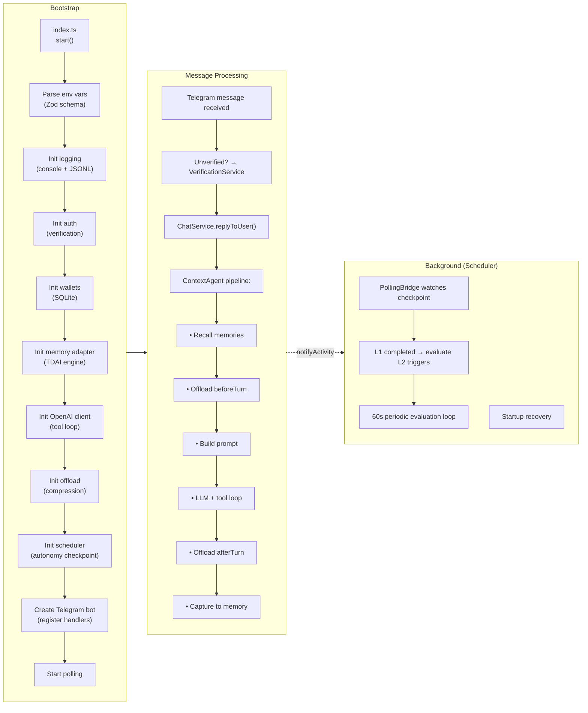

# agent

## Setup

```bash
bun install
cp .env.example .env

ccs codex --dangerously-skip-permissions
```

Running `bun install` at the repo root also installs dependencies in `TencentDB-Agent-Memory/`.

Set all OpenAI and Telegram values in `.env` before starting the bot.

Chat replies automatically retry timeout/abort failures up to 5 times by default.
This comes from `CHAT_TIMEOUT_RETRIES=5` in `.env.example`; set it to `0` only
if you intentionally want to disable timeout retries.

## Environment file guide

The file `.env.example` is the default configuration template for the real
`.env` file. Copy it first, then replace only the placeholder secrets required
for your bot:

```bash
cp .env.example .env
```

Do not commit `.env`. It contains private tokens and API keys.

The memory/offload values shown below are the defaults from `.env.example`.
Keep them unchanged unless you are intentionally testing a specific behavior.

### How env values are used

Environment variables are read once when the bot starts. After changing `.env`,
restart the bot so the new values are loaded.

For example, `CHAT_TIMEOUT_RETRIES=5` means:

1. The bot sends a chat request to the configured LLM API.
2. Each request attempt can run for up to `CHAT_TIMEOUT_MS`.
3. If the attempt fails because it timed out or was aborted, the bot tries
   again.
4. With `CHAT_TIMEOUT_RETRIES=5`, the bot can make 1 original attempt plus 5
   retry attempts for that LLM round.
5. It does not retry non-timeout failures such as invalid API keys, invalid
   model names, quota errors, or normal provider errors.

So with the default `CHAT_TIMEOUT_MS=12000` and `CHAT_TIMEOUT_RETRIES=5`, one
LLM round can spend up to about 72 seconds on timeout attempts before failing.

### Required secrets

These values must be set for the bot to run correctly.

| Variable | Example | What it is for |
|---|---|---|
| `BOT_TOKEN` | `123456789:telegram-bot-token` | Telegram bot token from BotFather. The bot uses this to connect to Telegram. |
| `OPENAI_API_KEY` | `sk-your-openai-key` | API key for the main chat model provider. |
| `EMBEDDING_API_KEY` | `sk-your-openai-key` | API key used by the embedding provider when embedding memory retrieval is enabled. Usually the same OpenAI key. |

### Admin access

| Variable | Default | What it is for |
|---|---|---|
| `ADMIN_USER_IDS` | empty | Comma-separated Telegram user IDs that can run admin commands. Example: `12345,67890`. |
| `SUPER_ADMIN_USER_ID` | empty | Optional single Telegram user ID allowed to run global force/admin operations. |

### Main LLM provider

These settings control the normal chat replies.

| Variable | Default in `.env.example` | What it is for |
|---|---|---|
| `MEMORY_AGENT` | `data` | Selects the memory/data agent mode used by this bot. Keep `data` unless the code adds another agent mode. |
| `PROVIDER` | `openai` | Main LLM provider name. This repo is documented for OpenAI-compatible APIs. |
| `BASE_URL` | `https://api.openai.com/v1` | Base URL for the main chat API. Change only if using an OpenAI-compatible gateway. |
| `MODEL` | `gpt-5.4-mini` | Main chat model used to answer Telegram messages. |
| `CHAT_TIMEOUT_MS` | `12000` | Maximum time allowed for one chat API attempt, in milliseconds. `12000` means each attempt can run for 12 seconds before being aborted. |
| `CHAT_TIMEOUT_RETRIES` | `5` | Extra attempts after a timeout/abort failure. `5` means 1 original attempt plus up to 5 retries. It does not retry invalid keys, invalid models, quota errors, or other non-timeout failures. |

### Embeddings

Embeddings are used for semantic memory search when `MEMORY_EMBEDDING_ENABLED=true`.

| Variable | Default in `.env.example` | What it is for |
|---|---|---|
| `EMBEDDING_BASE_URL` | `https://api.openai.com/v1` | Base URL for embedding API requests. |
| `EMBEDDING_MODEL` | `text-embedding-3-small` | Embedding model used to convert text into vectors. |
| `EMBEDDING_DIMENSIONS` | `1536` | Vector size expected from the embedding model. Must match the selected embedding model/config. |

### Autonomy checkpoint and scheduler

These values control the newer memory scheduler/checkpoint system.

| Variable | Default in `.env.example` | What it is for |
|---|---|---|
| `MEMORY_SCHEDULER_PHASE` | `none` | Scheduler mode: `none` disables it, `observer` logs only, `active` dispatches scheduled work. |
| `MEMORY_AUTONOMY_CHECKPOINT_NAMESPACE` | `memory_autonomy_state` | JSON key used to store autonomy scheduler state in the checkpoint file. |
| `MEMORY_AUTONOMY_CHECKPOINT_FILE_LOCK_ENABLED` | `true` | Enables file locking while writing checkpoints. Disable only for debugging lock issues. |

### TDAI memory feature gates

Feature gates turn memory maintenance behavior on or off.

| Variable | Default in `.env.example` | What it is for |
|---|---|---|
| `MEMORY_L2_FORCE_AFTER_IDLE_ENABLED` | `true` | Allows L2 memory processing to run after a session has been idle. |
| `MEMORY_L2_STARTUP_RECOVERY_ENABLED` | `true` | Allows recovery processing on startup if previous L2 work was missed. |
| `MEMORY_L2_STALE_REFRESH_ENABLED` | `true` | Refreshes stale L2 memory data. |
| `MEMORY_PERSONA_STALE_REFRESH_ENABLED` | `true` | Refreshes stale persona/scene data. |
| `MEMORY_PERSONA_FORCE_IF_MISSING_ENABLED` | `true` | Forces persona generation when no persona exists yet. |
| `MEMORY_SCENE_ARCHIVE_ENABLED` | `false` | Enables automatic archiving of stale scenes. |
| `MEMORY_SCENE_MERGE_ENABLED` | `false` | Enables deduplication/merge checks for similar scenes. |

### Scene maintenance

| Variable | Default in `.env.example` | What it is for |
|---|---|---|
| `MEMORY_SCENE_STALE_AFTER_DAYS` | `14` | Days without activity before a scene is considered stale. |
| `MEMORY_SCENE_ARCHIVE_AFTER_DAYS` | `21` | Days after becoming stale before a scene is archived. |
| `MEMORY_SCENE_MERGE_THRESHOLD` | `0.86` | Similarity threshold from `0.0` to `1.0` for scene merge detection. Higher means stricter matching. |

### Memory storage and extraction

| Variable | Default in `.env.example` | What it is for |
|---|---|---|
| `MEMORY_STORE_BACKEND` | `sqlite` | Storage backend for memory. This project supports SQLite here. |
| `MEMORY_CAPTURE_ENABLED` | `true` | Records raw conversations for the memory pipeline. |
| `MEMORY_L0L1_RETENTION_DAYS` | `0` | Deletes old L0/L1 memory data after N days. `0` disables retention cleanup. Minimum effective value is 3. |
| `MEMORY_ALLOW_AGGRESSIVE_CLEANUP` | `false` | Allows retention cleanup below the normal 3-day safety floor for local cleanup. |
| `MEMORY_CLEAN_TIME` | `03:00` | Daily memory cleanup time in `HH:mm` format. |
| `MEMORY_EXTRACTION_ENABLED` | `true` | Enables extracting structured memories from conversations. |
| `MEMORY_EXTRACTION_DEDUP` | `true` | Deduplicates extracted memories. |
| `MEMORY_MAX_MEMORIES` | `20` | Maximum extracted memories kept per session. |

### Persona and scene settings

| Variable | Default in `.env.example` | What it is for |
|---|---|---|
| `MEMORY_PERSONA_TRIGGER_N` | `5` | Runs persona/scene extraction every N conversations. |
| `MEMORY_PERSONA_MAX_SCENES` | `1000` | Maximum number of scenes to track. |
| `MEMORY_PERSONA_BACKUP_COUNT` | `3` | Number of persona backup copies to keep. |
| `MEMORY_PERSONA_SCENE_BACKUP` | `10` | Number of scene backup copies to keep. |
| `MEMORY_SCENE_EXTRACTION_TIMEOUT_MS` | `200000` | Timeout for scene extraction LLM calls, in milliseconds. `200000` means 200 seconds. |

### Memory pipeline scheduling

| Variable | Default in `.env.example` | What it is for |
|---|---|---|
| `MEMORY_PIPELINE_EVERY_N` | `10` | Runs the memory pipeline every N conversation turns. |
| `MEMORY_PIPELINE_WARMUP` | `true` | Starts/warmups the memory pipeline when the bot starts. |
| `MEMORY_L1_IDLE_TIMEOUT` | `600` | Idle time in seconds before L1 processing can run. |
| `MEMORY_L2_DELAY_AFTER_L1` | `5` | Delay in seconds after L1 completes before L2 can run. During scheduler migration this may be set much higher. |
| `MEMORY_L2_MIN_INTERVAL` | `900` | Minimum seconds between L2 runs. |
| `MEMORY_L2_MAX_INTERVAL` | `3600` | Maximum seconds between L2 checks/runs. During scheduler migration this may be set much higher. |
| `MEMORY_SESSION_WINDOW_HOURS` | `24` | Active-session window before idle sessions are deprioritized. |

### Memory recall/search

| Variable | Default in `.env.example` | What it is for |
|---|---|---|
| `MEMORY_RECALL_ENABLED` | `true` | Injects relevant memories into the prompt when building context. |
| `MEMORY_RECALL_MAX_RESULTS` | `5` | Maximum number of recalled memories to add to the prompt. |
| `MEMORY_RECALL_SCORE_THRESHOLD` | `0.3` | Minimum relevance score from `0.0` to `1.0` for recalled memories. |
| `MEMORY_RECALL_STRATEGY` | `keyword` | Search strategy. The example uses keyword search. |
| `MEMORY_RECALL_TIMEOUT_MS` | `5000` | Timeout for recall/search in milliseconds. |
| `MEMORY_EMBEDDING_ENABLED` | `false` | Enables embedding-based retrieval. Requires embedding provider settings. |
| `MEMORY_EMBEDDING_PROVIDER` | `none` | Embedding provider identifier. Use a real provider when embedding retrieval is enabled. |
| `MEMORY_BM25_ENABLED` | `true` | Enables BM25 keyword full-text search. |
| `MEMORY_BM25_LANGUAGE` | `en` | Language model used by BM25 search. |

### Offload feature gates

Offload compresses or summarizes context so long conversations do not exceed the
model context window.

| Variable | Default in `.env.example` | What it is for |
|---|---|---|
| `OFFLOAD_RECLAIM_ENABLED` | `true` | Enables offload data/log cleanup. |
| `OFFLOAD_L2_WAIT_RETRY_ENABLED` | `true` | Enables retry behavior while waiting for L2 offload entries. |
| `OFFLOAD_ENABLED` | `true` | Master switch for the offload module. Set `false` to disable context compression. |
| `OFFLOAD_MODEL` | `ggpt-5.4-mini` | Model used for offload tasks such as summaries and MMD generation. Falls back to `MODEL` when unset. |
| `OFFLOAD_MODE` | `backend` | Offload execution mode. `backend` uses an offload service; `local` uses the configured local LLM client path. |
| `OFFLOAD_TEMPERATURE` | `0.2` | Low temperature for deterministic offload summaries/classification. |
| `OFFLOAD_FORCE_TRIGGER_THRESHOLD` | `4` | Forces L1 summarization when this many tool call/result pairs are pending. |
| `OFFLOAD_CONTEXT_WINDOW` | `200000` | Context window size in tokens. Set this to match the real limit of `MODEL`. |
| `OFFLOAD_MAX_PAIRS_PER_BATCH` | `20` | Maximum tool call/result pairs summarized in one offload batch. |
| `OFFLOAD_L1_ENABLED` | `true` | Enables L1 tool pair summarization. |
| `OFFLOAD_L15_ENABLED` | `true` | Enables L1.5 task boundary detection. |
| `OFFLOAD_L2_ENABLED` | `true` | Enables L2 Mermaid MMD generation. |
| `OFFLOAD_RETENTION_DAYS` | `0` | Deletes old offload data after N days. `0` disables retention cleanup. Minimum effective value is 3. |
| `OFFLOAD_LOG_MAX_SIZE_MB` | `50` | Maximum total offload debug log size before cleanup truncates logs. |
| `OFFLOAD_BACKEND_URL` | empty | URL of the optional backend offload service. Required when using a backend service. |
| `OFFLOAD_BACKEND_API_KEY` | empty | API key for the optional backend offload service. |
| `OFFLOAD_BACKEND_TIMEOUT_MS` | `10000` | Timeout for backend offload service requests, in milliseconds. |
| `OFFLOAD_USER_ID` | empty | Optional user ID used by the backend offload service for persistence/partitioning. |

### Offload compression thresholds

All ratio values are from `0.0` to `1.0` and are multiplied by
`OFFLOAD_CONTEXT_WINDOW`.

| Variable | Default in `.env.example` | What it is for |
|---|---|---|
| `OFFLOAD_MILD_RATIO` | `0.85` | Starts mild compression at 85% of the context window. |
| `OFFLOAD_AGGRESSIVE_RATIO` | `0.85` | Starts aggressive compression at 85% of the context window. |
| `OFFLOAD_EMERGENCY_RATIO` | `0.95` | Starts emergency compression at 95% of the context window. |
| `OFFLOAD_EMERGENCY_TARGET_RATIO` | `0.6` | Emergency compression target after deleting/compressing messages. |
| `OFFLOAD_AGGRESSIVE_DELETE_RATIO` | `0.4` | Fraction of oldest messages deleted per aggressive compression round. |
| `OFFLOAD_MILD_SCAN_RATIO` | `0.7` | Fraction of messages scanned for mild compression candidates. |
| `OFFLOAD_MMD_MAX_TOKEN_RATIO` | `0.2` | Maximum part of the context window allowed for injected MMD content. |

### Offload L2 scheduling

| Variable | Default in `.env.example` | What it is for |
|---|---|---|
| `OFFLOAD_L2_NULL_THRESHOLD` | `4` | Minimum null-score entries before L2 generation/checking triggers. |
| `OFFLOAD_L2_TIMEOUT_SECONDS` | `300` | Seconds since the last L2 run before another L2 check can run. |

## Run

```bash
bun run index.ts
```

## Verification flow

1. A new Telegram user sends any text message.
2. The bot writes a one-time verification code to `data/logs/<yyyy-mm-dd>-verification.log`.
3. The user sends that code back in Telegram.
4. After a successful match, the user stays verified for future chats.

## Architecture & Execution Flow

The bot follows a layered execution flow from bootstrap through message processing:



### Bootstrap sequence

1. `index.ts` calls `start()`
2. Parse env vars via Zod (`src/config/env.ts`)
3. Resolve data paths, create loggers, ensure directories
4. Initialize auth (verification store + service)
5. Initialize wallets (primary + backup SQLite, wallet service, PK access)
6. Initialize TDAI memory adapter (recall/capture engine)
7. Initialize OpenAI chat client with tool loop
8. Wire memory search tools, coordination service
9. Initialize offload service (context compression, optional)
10. Initialize scheduler + autonomy checkpoint (Phase 1+)
11. Create Telegram bot, register all command handlers
12. Start polling loop

### Per-turn processing

Each user message follows this pipeline in `ContextAgent`:

1. **L4 skill check** — `/create-skill` command handling
2. **Memory recall** — retrieve relevant memories from TDAI engine
3. **Offload beforeTurn** — L3-compress conversation history
4. **Build prompt** — assemble system + user prompt with scenes/injection
5. **LLM + tool loop** — call OpenAI with tool call handling
6. **Offload afterTurn** — flush L1 entries, schedule L2 if needed
7. **Memory capture** — record the completed turn into TDAI

## Wallet commands

- `/wallets-gen` - Generate one Solana wallet, save it in SQLite, and reply with the public address only. Each Telegram user can keep up to 10 wallets.
- `/wallets-list` - List your saved wallet public addresses and mark the active wallet.
- `/wallets-now` - Show only your active wallet public address.
- `/wallets-active <public-address>` - Make one of your saved wallets the active wallet.
- `/wallets-delete <public-address>` - Delete one of your saved wallets. If you delete the active wallet, the newest remaining wallet becomes active.
- `/wallets-privatekey <public-address>` - Issue a 6-digit code in the server logs. Send that code as your next Telegram message to reveal the private key. Any other next message cancels the request.

Wallet secrets are not shown by `/wallets-gen`, `/wallets-list`, or `/wallets-now`.

## Admin Commands

These commands are available to users listed in `ADMIN_USER_IDS`:

| Command | Description |
|---|---|
| `/memory-status` | Show memory pipeline state — checkpoint counters, job status, and scheduler phase. |
| `/offload-status` | Show offload service state — enabled layers, session count, pending entries. |
| `/offload-reclaim --confirm` | Run offload data retention cleanup. Requires `--confirm` flag to execute. |

Admin identity is configured via:

- `ADMIN_USER_IDS` — comma-separated Telegram user IDs with admin access
- `SUPER_ADMIN_USER_ID` — optional single user ID for global force operations

## Storage Layout

Runtime data is stored under the configured `MEMORY_AGENT` root (default: `data/`):

```
data/
├── auth/
│   ├── pending-codes.json
│   └── verified-users.json
├── logs/
│   └── <yyyy-mm-dd>-verification.log
├── memory-tdai/
│   ├── checkpoint.json             # TDAI pipeline checkpoint (L1/L2 state)
│   ├── autonomy_checkpoint.json    # Autonomy scheduler checkpoint (Phase 1+)
│   └── offload/
│       └── telegram-bot/
│           ├── session-{uuid}/     # Per-session directory
│           │   ├── offload-{id}.jsonl
│           │   ├── state.json
│           │   └── mmds/
│           └── registry.json
└── wallets/
    ├── wallets.sqlite              # Primary wallet database
    └── wallets-backup.sqlite       # Backup wallet database
```

## Scheduler & Autonomy

The autonomous scheduler drives background memory maintenance — L2 catch-up triggers,
pipeline warmup, and persona/scene updates — without blocking user-facing chat.

The scheduler is controlled by `MEMORY_SCHEDULER_PHASE`:

| Phase | Behavior |
|---|---|
| `none` | Scheduler code is completely disabled (no-ops). |
| `observer` | Evaluates L2/persona trigger conditions and logs decisions. Never dispatches jobs. Safe for production monitoring. |
| `active` | Evaluates and dispatches L2/persona jobs through a global concurrency limiter (max 3 simultaneous jobs). |

### Trigger mechanisms

1. **PollingBridge** — watches the TDAI checkpoint file every 2s for L1 completions
2. **Periodic evaluation** — 60s loop re-checks timing-based triggers (force_after_idle, max_interval)
3. **Startup recovery** — schedules delayed L2 for sessions with pending work on boot
4. **Stale refresh** — periodic checks on scene index age
5. **Cold session cleanup** — marks and prunes idle sessions (10min interval, 1hr timeout)

### Feature gates

Each trigger can be independently enabled/disabled via environment variables:

- `MEMORY_L2_FORCE_AFTER_IDLE_ENABLED` — L2 after session idle
- `MEMORY_L2_STARTUP_RECOVERY_ENABLED` — recovery on boot
- `MEMORY_L2_STALE_REFRESH_ENABLED` — stale L2 refresh
- `MEMORY_PERSONA_STALE_REFRESH_ENABLED` — stale persona/scene update
- `MEMORY_PERSONA_FORCE_IF_MISSING_ENABLED` — generate missing persona
- `MEMORY_SCENE_ARCHIVE_ENABLED` — auto-archive stale scenes
- `MEMORY_SCENE_MERGE_ENABLED` — dedup similar scenes

Key state is persisted in the `memory_autonomy_state` namespace inside the TDAI
checkpoint file via `MemoryAutonomyCheckpoint` (Step 38).

## Memory (TDAI) Configuration

The TDAI memory pipeline is configured through environment variables. The
defaults below should match `.env.example`; keep them as-is unless you are
intentionally testing memory behavior.

### Store & Capture

| Variable | Default | Description |
|---|---|---|
| `MEMORY_STORE_BACKEND` | `sqlite` | Storage backend (only sqlite supported) |
| `MEMORY_CAPTURE_ENABLED` | `true` | Enable raw conversation recording |
| `MEMORY_L0L1_RETENTION_DAYS` | `0` | Auto-delete L0/L1 memory data older than N days (0 = disabled, minimum effective: 3) |
| `MEMORY_ALLOW_AGGRESSIVE_CLEANUP` | `false` | Allow local memory retention below 3 days |
| `MEMORY_CLEAN_TIME` | `03:00` | Daily memory cleanup time in HH:mm |
| `MEMORY_EXTRACTION_ENABLED` | `true` | Enable memory extraction pipeline |
| `MEMORY_EXTRACTION_DEDUP` | `true` | Deduplicate extracted memories |
| `MEMORY_MAX_MEMORIES` | `20` | Maximum extracted memories kept per session |

### Persona / Scenes

| Variable | Default | Description |
|---|---|---|
| `MEMORY_PERSONA_TRIGGER_N` | `5` | Trigger persona extraction every N conversations |
| `MEMORY_PERSONA_MAX_SCENES` | `1000` | Maximum tracked scenes |
| `MEMORY_PERSONA_BACKUP_COUNT` | `3` | Number of persona backup copies |
| `MEMORY_PERSONA_SCENE_BACKUP` | `10` | Number of scene backup copies |

### Pipeline Scheduling

| Variable | Default | Description |
|---|---|---|
| `MEMORY_PIPELINE_EVERY_N` | `10` | Run pipeline every N conversation turns |
| `MEMORY_PIPELINE_WARMUP` | `true` | Warm up pipeline on startup |
| `MEMORY_L1_IDLE_TIMEOUT` | `600` | L1 idle timeout (seconds, 600 = 5 min) |
| `MEMORY_L2_DELAY_AFTER_L1` | `5` | L2 delay after L1 completes (seconds) |
| `MEMORY_L2_MIN_INTERVAL` | `900` | Minimum interval between L2 runs (seconds) |
| `MEMORY_L2_MAX_INTERVAL` | `3600` | Maximum interval between L2 runs (seconds) |
| `MEMORY_SESSION_WINDOW_HOURS` | `24` | Session active window before pipeline deprioritises idle sessions |

### Memory Recall

| Variable | Default | Description |
|---|---|---|
| `MEMORY_RECALL_ENABLED` | `true` | Enable memory recall when building context |
| `MEMORY_RECALL_MAX_RESULTS` | `5` | Maximum number of recalled memories to inject |
| `MEMORY_RECALL_SCORE_THRESHOLD` | `0.3` | Minimum relevance score threshold (0.0–1.0) |
| `MEMORY_RECALL_STRATEGY` | `keyword` | Retrieval strategy |
| `MEMORY_RECALL_TIMEOUT_MS` | `5000` | Recall timeout in milliseconds |

### Embedding & BM25

| Variable | Default | Description |
|---|---|---|
| `MEMORY_EMBEDDING_ENABLED` | `false` | Enable embedding-based retrieval (requires provider) |
| `MEMORY_EMBEDDING_PROVIDER` | `none` | Embedding provider identifier |
| `MEMORY_BM25_ENABLED` | `true` | Enable BM25 keyword-based search |
| `MEMORY_BM25_LANGUAGE` | `en` | BM25 language model |

## Offload Module (Context Compression)

The offload module prevents context window overflow by compressing conversation
history. It wraps the TencentDB-Agent-Memory library's offload algorithms into a
clean lifecycle integrated with the bot's `ChatService`.

### Architecture

The offload pipeline runs on every conversation turn:

```
  beforeTurn()         onToolCall()           afterTurn()
     │                    │                      │
  ┌──┴──┐             ┌──┴──┐                ┌──┴──┐
  │ L3  │             │Buffer│               │ L1  │
  │Comp.│             │Pairs │               │Flush│
  └─────┘             └─────┘                └─────┘
     │                                           │
     ▼                                           ▼
  History │                                  L1 entries
  compressed│                                 written to
  (mild/aggressive/     ◄──────               offload.jsonl
   emergency)

  (optional) L1.5: task boundary detection after L1 flush
  (optional) L2:    Mermaid MMD generation from entries
```

### Lifecycle (called from `ChatService.replyToUser()`)

| Method | When | What |
|---|---|---|
| `beforeTurn()` | Before LLM prompt build | L3-compress conversation history using mild/aggressive/emergency tiers. Optionally inject active MMD (if L2 enabled). |
| `onToolCall()` | During tool loop | Buffer tool call + result pairs for L1 summarization. |
| `afterTurn()` | After LLM reply | Flush L1 entries to JSONL (via LLM or degraded fallback). Run L1.5 judgment. Schedule L2 generation. |
| `close()` | Shutdown | Save all sessions, clear L2 and reclaim timers. |

### Compression Tiers

Compression is applied in order of severity (thresholds relative to `OFFLOAD_CONTEXT_WINDOW`):

| Tier | Trigger | Action |
|---|---|---|
| **Mild** | ≥ `mildOffloadRatio` (default 85%) | Replace tool result messages with L1 summaries. Requires L1 entries. |
| **Aggressive** | ≥ `aggressiveCompressRatio` (default 85%) | Delete oldest messages in rounds. |
| **Emergency** | ≥ `emergencyCompressRatio` (default 95%) | Delete messages down to `emergencyTargetRatio` (default 60%). |

### Why `OFFLOAD_TEMPERATURE` and `OFFLOAD_CONTEXT_WINDOW`?

These two configuration parameters are fundamental to how the offload module operates across all layers. Understanding why they exist helps you tune them correctly.

#### `OFFLOAD_TEMPERATURE` (default: `0.2`) — Determinism for offload LLM calls

Controls the LLM's creativity/randomness for offload tasks (L1 summarization, L1.5 task boundary judgment, L2 MMD generation).

| Chat LLM (e.g. `gpt-4o-mini`) | Offload LLM (e.g. `OFFLOAD_MODEL`) |
|---|---|
| Temperature ~0.7–1.0 | Temperature **0.2** (low) |
| Creative, varied responses | Deterministic, consistent output |
| User-facing conversation | Behind-the-scenes summarization |

> **Note:** The same model can serve both roles (by default `OFFLOAD_MODEL` falls back to `MODEL`).
> Temperature is applied per-API-call, so the model runs at 0.2 for offload tasks regardless of the chat temperature.

**Why so low?** Summarization and classification are deterministic tasks — you want consistent, factual summaries rather than creative variations. A higher temperature would produce different summaries for the same tool call on different runs, making the compressed history unpredictable.

- Default `0.2` matches the library's `PLUGIN_DEFAULTS` — battle-tested across many deployments.
- Only relevant when L1, L1.5, or L2 is enabled (requires a model for LLM calls).
- L3 compression alone does **not** use temperature (no LLM calls needed).

#### `OFFLOAD_CONTEXT_WINDOW` (default: `200000`) — The anchor for all compression thresholds

The model's total token capacity. All compression tier thresholds are calculated as **ratios of this value**:

```
mildThreshold       = contextWindow × OFFLOAD_MILD_RATIO           (default: 200K × 0.85 = 170K)
aggressiveThreshold = contextWindow × OFFLOAD_AGGRESSIVE_RATIO     (default: 200K × 0.85 = 170K)
emergencyThreshold  = contextWindow × OFFLOAD_EMERGENCY_RATIO      (default: 200K × 0.95 = 190K)
emergencyTarget     = contextWindow × OFFLOAD_EMERGENCY_TARGET     (default: 200K × 0.60 = 120K)
mmdMaxTokens        = contextWindow × OFFLOAD_MMD_MAX_TOKEN_RATIO  (default: 200K × 0.20 =  40K)
```

**Must match your model's actual context window.** Different models have drastically different limits:

| Model | Context Window | `OFFLOAD_CONTEXT_WINDOW` |
|---|---|---|
| GPT-4o-mini / GPT-4o | 128,000 tokens | `128000` |
| Claude 3.5 Sonnet | 200,000 tokens | `200000` |
| Claude 3 Opus | 200,000 tokens | `200000` |
| Gemini 1.5 Pro | up to 2,097,152 tokens | `2097152` |
| DeepSeek-V2 | 128,000 tokens | `128000` |

- **If set too high** (> actual model limit): compression won't trigger before the API truncates your request (→ hard error from the API provider).
- **If set too low** (≪ actual model limit): compression triggers prematurely (→ unnecessary message deletion, context lost for no reason).
- **This does not affect the API's `max_tokens` parameter** — it only controls when the compressor activates.
- The `.env.example` default is `200000`. Keep that default unless you are
  intentionally matching a different model limit.
- Even with all optional features disabled (L1/L1.5/L2 = false), `OFFLOAD_CONTEXT_WINDOW` is **required** — L3 compression still needs it to calculate thresholds.
- `OFFLOAD_TEMPERATURE` is only plumbed to the `LocalLlmClient` (L1/L1.5/L2). L3 compression (which works autonomously) does **not** use temperature at all.

### Environment Variables

| Variable | Default | Description |
|---|---|---|
| `OFFLOAD_ENABLED` | `true` | Master switch — set to `false` to disable offload completely |
| `OFFLOAD_MODEL` | `ggpt-5.4-mini` | Separate LLM model for offload tasks (L1/L1.5/L2). Falls back to the main `MODEL` when not set. |
| `OFFLOAD_MODE` | `backend` | Offload LLM execution mode (`local` or `backend`) |
| `OFFLOAD_TEMPERATURE` | `0.2` | LLM temperature for offload tasks |
| `OFFLOAD_FORCE_TRIGGER_THRESHOLD` | `4` | Force-trigger L1 summarization when pending tool pairs reaches this count |
| `OFFLOAD_CONTEXT_WINDOW` | `200000` | Model context window size (tokens) |
| `OFFLOAD_MAX_PAIRS_PER_BATCH` | `20` | Maximum tool pairs per offload batch |
| `OFFLOAD_L1_ENABLED` | `true` | Enable L1 tool pair summarization (requires a model — defaults to main `MODEL`) |
| `OFFLOAD_L15_ENABLED` | `true` | Enable L1.5 task boundary detection (requires a model) |
| `OFFLOAD_L2_ENABLED` | `true` | Enable L2 Mermaid MMD generation (requires a model) |
| `OFFLOAD_RETENTION_DAYS` | `0` | Auto-delete data older than N days (0 = disabled, minimum effective: 3) |
| `OFFLOAD_LOG_MAX_SIZE_MB` | `50` | Max total offload debug log size before reclaim truncates logs |
| `OFFLOAD_BACKEND_URL` | _(unset)_ | Optional backend offload service URL |
| `OFFLOAD_BACKEND_API_KEY` | _(unset)_ | Optional backend offload service API key |
| `OFFLOAD_BACKEND_TIMEOUT_MS` | `10000` | Backend offload service timeout |
| `OFFLOAD_USER_ID` | _(unset)_ | Optional backend offload persistence user id |

#### Compression Thresholds

| Variable | Default | Description |
|---|---|---|
| `OFFLOAD_MILD_RATIO` | `0.85` | Token utilisation ratio triggering mild compression |
| `OFFLOAD_AGGRESSIVE_RATIO` | `0.85` | Token utilisation ratio triggering aggressive compression |
| `OFFLOAD_EMERGENCY_RATIO` | `0.95` | Token utilisation ratio triggering emergency compression |
| `OFFLOAD_EMERGENCY_TARGET_RATIO` | `0.6` | Target utilisation after emergency compression |
| `OFFLOAD_AGGRESSIVE_DELETE_RATIO` | `0.4` | Fraction of oldest messages to delete per aggressive round |
| `OFFLOAD_MILD_SCAN_RATIO` | `0.7` | Fraction of messages scanned for mild compression candidates |
| `OFFLOAD_MMD_MAX_TOKEN_RATIO` | `0.2` | Max fraction of context window for MMD injection |

#### L2 Scheduling

| Variable | Default | Description |
|---|---|---|
| `OFFLOAD_L2_NULL_THRESHOLD` | `4` | Minimum null-score entries before L2 triggers |
| `OFFLOAD_L2_TIMEOUT_SECONDS` | `300` | Seconds since last L2 before a new check runs |

### Data location

Offload data lives under `memory-tdai/offload/telegram-bot/` within the data tree shown in the [## Storage Layout](#storage-layout) section above.

### Quick Start Example

Enable the context compression layer (no LLM model needed for L3 compression):

```env
OFFLOAD_ENABLED=true
OFFLOAD_CONTEXT_WINDOW=200000
OFFLOAD_AGGRESSIVE_RATIO=0.85
```

Enable L1 summarization (requires a model for LLM calls):

```env
OFFLOAD_ENABLED=true
OFFLOAD_MODEL=gpt-4o-mini
OFFLOAD_L1_ENABLED=true
```

### Running Tests

```bash
# All offload tests
bun test src/offload/

# Specific test categories
bun test src/offload/integration.test.ts   # E2E integration tests
bun test src/offload/compressor.test.ts    # Compression unit tests
bun test src/offload/index.test.ts         # Lifecycle unit tests

# Performance benchmark
bun scripts/offload-benchmark.ts
```

## Constraints

- OpenAI only in V1
- Text-only chat in V1
- No source edits inside `TencentDB-Agent-Memory/`
