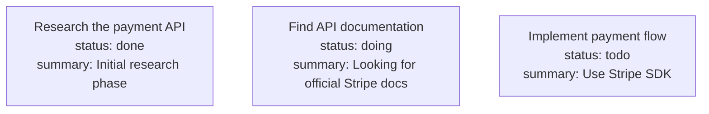
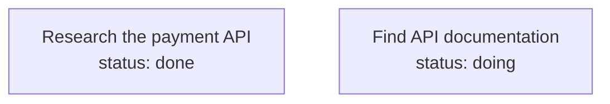

# Context Offload Module — Standalone Integration Design

## Status: Draft v3 (Full deep-dive analysis)

---

## 1. Executive Summary

The `TencentDB-Agent-Memory` library includes a **multi-layer context compression engine** (`src/offload/`) with 6 layers (L0–L4+L3). Originally designed for the OpenClaw plugin runtime via `registerOffload(api, offloadConfig)`, the core algorithms are **standalone pure functions** that can be imported and used directly.

This spec documents the **complete internal architecture** of the offload module based on a full read of all 24 source files, then prescribes a phased integration plan for the Telegram bot.

### 1.1 What Each Layer Does

| Layer | Name | Purpose | Standalone? |
|---|---|---|---|
| L0 | Conversation Recording | Records raw conversation round | ✅ Built-in (TDAI) |
| L1 | Tool Pair Summarization | Captures tool call/result → LLM-summarized entries | ✅ Requires tool calls |
| L1.5 | Task Boundary Detection | LLM judgment: continuing task / new task / casual chat | ✅ Requires L1 |
| L2 | MMD Generation | Builds Mermaid flowchart tracking task progress | ✅ Requires L1.5 |
| **L3** | **Context Compression** | **Prevents context window overflow** | **✅ PRIMARY VALUE** |
| L4 | Skill Generation | Creates reusable skill docs from completed tasks | ❌ Backend-only |

**Primary value for the Telegram bot: L3 Context Compression.** It enables long conversations without hitting token limits.

---

## 2. Module Architecture — Internal Structure

### 2.1 Module-Level State (Singletons)

The offload module uses **6 module-level globals** in `index.ts`. They persist across `registerOffload()` calls (OpenClaw calls it multiple times during lifecycle).

```typescript
// ─── OffloadContextEngine singleton ─────────────────────────────────
let _sharedEngine: OffloadContextEngine | null = null;
let _contextEngineRegistered = false;
let _contextEngineRejected = false;

// ─── L2 scheduler state (prevents concurrent runs) ─────────────────
let _l2Running = false;                  // Prevents concurrent L2 runs
let _l2PollHandle: ReturnType<typeof setTimeout> | null = null;  // Poll timer
let _l2FirstNotifyAt: number | null = null;  // First L2 trigger timestamp

// ─── L1.5 lifecycle ───────────────────────────────────────────────
let _l15Disposed = false;                // Cancel retry loop flag

// ─── Reclaim scheduler ────────────────────────────────────────────
let _reclaimTimer: ReturnType<typeof setTimeout> | null = null;

// ─── Session routing ──────────────────────────────────────────────
let _sharedSessions: SessionRegistry | null = null;
```

**Key insight:** `_sharedEngine` and `_sharedSessions` are singletons because OpenClaw's lifecycle registration is additive — multiple `registerOffload()` calls must share the same engine and session state.

### 2.2 Layer Stack — Lifecycle Diagram

```
OpenClaw Hook Chain                          Offload Hook
─────────────────────────────────────        ────────────
before_prompt_build                         → flushL1() + injectMmdIntoMessages()
    │
before_agent_start                          → handleTaskTransition() + /create-skill
    │
llm_input                                   → compressByScoreCascade() (L3)
    │                                           + buildTiktokenContextSnapshot()
    │
[user message]
    │
assemble (Context Engine)                   → injectMmdIntoMessages() if L1.5 settled
    │                                           + L3 compression
    │                                           + L1.5 judgeL15() if pending pairs exist
    │
[LLM call with tool_use blocks]
    │
after_tool_call (×N for each tool)         → captureToolPair() → buffer
    │                                           + L3 inline compression
    │                                           + maybeUpdateMmdInMessages()
    │                                           + check shouldForceL1()
    │                                           + (if forced) flushL1()
    │
after_tool_call (post-loop)                → judgeL15() if pairs flushed
    │                                           + (if L1.5 settled) runL2() async
    │
llm_output                                  → check shouldForceL1() by pending count
    │
[return to agent loop]
    │
afterTurn (Context Engine)                  → flush remaining pending pairs
```

### 2.3 File Inventory (24 files)

```
TencentDB-Agent-Memory/src/offload/
├── index.ts              ← registerOffload() entry (~1300 lines). NOT used directly.
├── types.ts              ← OffloadEntry, TaskJudgment, PluginConfig, PluginLogger, PLUGIN_DEFAULTS
│
├── state-manager.ts      ← OffloadStateManager per-session state
├── session-registry.ts   ← SessionRegistry: sessionKey → OffloadStateManager (LRU, max 20)
├── storage.ts            ← File I/O: JSONL append/read/write, MMD read/write, ref MD, state.json
│
├── backend-client.ts     ← HTTP client for remote backend (mode: "backend"). NOT used.
├── user-id.ts            ← IP-based user ID resolver. NOT used (OpenClaw context).
│
├── local-llm/
│   ├── index.ts          ← LocalLlmClient class (direct import)
│   ├── llm-caller.ts     ← AI SDK wrapper for LLM calls
│   ├── prompts/
│   │   ├── l1-prompt.ts  ← Tool call summarization prompt
│   │   ├── l15-prompt.ts ← Task boundary judgment prompt
│   │   └── l2-prompt.ts  ← Mermaid flowchart generation prompt
│   └── parsers/
│       ├── l1-parser.ts  ← Parse L1 LLM output → OffloadEntry[]
│       ├── l15-parser.ts ← Parse L1.5 LLM output → TaskJudgment
│       └── l2-parser.ts  ← Parse L2 LLM output → nodeMapping
│
├── l3-helpers.ts         ← Utility functions for L3 compression (14 exports)
├── l3-token-counter.ts   ← createL3TokenCounter() with tiktoken fallback
├── context-token-tracker.ts ← buildTiktokenContextSnapshot() for message token estimation
│
├── hooks/
│   ├── after-tool-call.ts  ← Tool pair capture + inline L3 + MMD update
│   ├── before-prompt-build.ts ← L1 flush + L3 guard + MMD injection
│   ├── llm-input-l3.ts     ← CORE: compressByScoreCascade(), aggressiveCompressUntilBelowThreshold(),
│   │                           emergencyCompress(), buildHistoryMmdInjection()
│   ├── llm-output.ts       ← shouldForceL1() threshold check
│   └── before-agent-start.ts ← handleTaskTransition(), normalizeJudgment()
│
├── mmd-injector.ts       ← injectMmdIntoMessages(), maybeUpdateMmdInMessages()
├── mmd-meta.ts           ← parseMmdMeta() for MMD file metadata extraction
│
├── pipelines/
│   └── l2-mermaid.ts     ← checkL2Trigger(), backfillNodeIds() for MMD scheduling
│
├── reclaimer.ts          ← reclaimOffloadData() — 5-step cleanup (JSONL, refs, MMDs, logs, registry)
├── state-reporter.ts     ← L3 trigger reports with cumulative counters
├── opik-tracer.ts        ← Optional Opik observability (graceful if package missing)
├── time-utils.ts         ← nowChinaISO(), toChinaISO() (UTC+8 timestamps)
└── session-registry.ts   ← SessionRegistry class (imported by index.ts)
```

---

## 3. Layer-by-Layer Deep Dive

### 3.1 L1 — Tool Pair Capture & Summarization

**File:** `hooks/after-tool-call.ts` (logic) + `index.ts` (flushL1 closure)

**Purpose:** Capture every `{toolName, toolCallId, params, result, timestamp}` pair, then LLM-summarize into compact `OffloadEntry[]`.

#### Capture Flow

```typescript
// after_tool_call hook fires for EACH tool call in the loop:
async function afterToolCallHandler(event: { toolName, toolCallId, params, result, timestamp }) {
  // 1. Skip if session is internal memory pipeline
  if (isInternalMemorySession(sessionKey)) return;

  // 2. Skip duplicate tool_call_ids (already processed)
  if (stateManager.processedToolCallIds.has(toolCallId)) return;

  // 3. Buffer the pair
  stateManager.pushPending({ toolName, toolCallId, params, result, timestamp });

  // 4. Run L3 compression inline (before next LLM call)
  //    This prevents context build-up during multi-turn tool loops

  // 5. Check if MMD needs refreshing (L2 may have updated it)
  await maybeUpdateMmdInMessages(messages, stateManager, logger, ...);

  // 6. Check force-trigger threshold
  if (shouldForceL1(stateManager, pluginConfig)) {
    await flushL1(stateManager, "force_trigger");
  }
}
```

#### L1 Flush (`flushL1()` in `index.ts`)

```typescript
async function flushL1(stateManager, triggerSource, fireAndForget = false, maxCount?) {
  // 1. Acquire L1 lock (mutex — prevents concurrent flushes)
  const release = await stateManager.acquireL1Lock();
  try {
    // 2. Take pending pairs from buffer
    const pairs = stateManager.takePending(takeCount);

    // 3. Filter out heartbeat probes ("HEARTBEAT.md" in params)
    pairs = pairs.filter(p => !p.params.includes("HEARTBEAT.md"));

    // 4. L1.1: Write raw tool results as .md ref files
    const refByToolCallId = new Map<string, string>();
    for (const p of pairs) {
      const refPath = await writeRefMd(ctx, p.timestamp, p.toolName, formatResult(p.result));
      refByToolCallId.set(p.toolCallId, refPath);
    }

    // 5. Split into batches of 5 (L1_BATCH_SIZE)
    const batches = chunk(pairs, 5);

    // 6. For each batch → LLM summarize
    for (const chunk of batches) {
      try {
        const resp = await backendClient.l1Summarize({
          recentMessages: buildRecentContext(stateManager),
          toolPairs: chunk.map(p => ({ toolName, toolCallId, params, result, timestamp })),
        });
        // Link result_ref from L1.1
        for (const entry of resp.entries) {
          if (!entry.result_ref && refByToolCallId.has(entry.tool_call_id)) {
            entry.result_ref = refByToolCallId.get(entry.tool_call_id);
          }
        }
        // Append to offload-{sessionId}.jsonl
        await appendOffloadEntries(ctx, resp.entries);
      } catch (err) {
        // Retry up to 3 times, then degrade: write truncated raw text
        if (retries >= MAX_L1_CHUNK_RETRIES) {
          // Fallback entries (no LLM summary, just truncated raw text)
          await appendOffloadEntries(ctx, fallbackEntries.map(p => ({
            tool_call: `${p.toolName}(...)`,
            summary: `[L1 degraded] ${p.toolName}: ${truncate(p.result, 300)}`,
            result_ref: refByToolCallId.get(p.toolCallId),
            ...
          })));
        } else {
          // Re-enqueue for next flush
          stateManager.pendingToolPairs.push(...chunk);
        }
      }
    }
  } finally {
    release(); // Release L1 lock
  }
}
```

**Retry/fallback logic:**
- Max 3 retries per chunk
- On failure: re-enqueue chunk, increment fail counter
- After 3 failures: write "degraded" entries (truncated raw text, no LLM summary)
- Results of ALL attempts (success or degraded) are stored in JSONL

#### L1 Storage Format

```jsonl
{"timestamp":"2026-05-21T10:00:00.000+08:00","node_id":null,"tool_call":"search_files(\"src/\")",
 "summary":"Searched src/ for .ts files, found index.ts and utils.ts (12 results total)",
 "result_ref":"refs/2026-05-21T10-00-00-000-foo.md","tool_call_id":"call_abc123","score":0}
```

After L2 assigns a node: `node_id` is updated to e.g., `"001-N3"`.

---

### 3.2 L1.5 — Task Boundary Detection

**File:** `hooks/before-agent-start.ts` + `index.ts` (judgeL15 closure)

**Purpose:** After each user message + tool loop, determine whether the user's activity:
- **Continues** the previous task (→ reactivate old MMD)
- **Starts a new task** (→ create new MMD)
- Is **casual conversation** (→ no MMD, entries are "short")

#### Judgment Flow

```typescript
async function judgeL15(stateManager, event, ctx) {
  // 1. Pre-flush: flush ALL pending pairs that existed BEFORE this user message
  const snapshotCount = stateManager.getPendingCount();
  await flushL1(stateManager, "l15_pre_flush", false, snapshotCount);

  // 2. Record boundary start index
  const startIndex = stateManager.entryCounter;

  // 3. Build request
  const recentMessages = buildRecentContext(stateManager);
  const availableMmdMetas = parseAllMmdMetas(stateManager);
  const currentMmd = readCurrentMmd(stateManager);

  // 4. Send to LLM (with 1 retry)
  const judgment = await attemptL15(stateManager, startIndex, {
    recentMessages,
    currentMmd,
    availableMmdMetas,
  });

  if (!judgment) {
    // Retry after 3 seconds
    await delay(3000);
    judgment = await attemptL15(stateManager, startIndex, { ... });
  }

  if (!judgment) {
    // Both attempts failed → fail-safe: "short" boundary, no MMD
    await l15FailSafe(stateManager, startIndex);
    return;
  }

  // 5. Apply task transition
  await handleTaskTransition(stateManager, judgment, logger);
}
```

#### Task Transition Logic (`handleTaskTransition()`)

```typescript
async function handleTaskTransition(stateManager, judgment, logger) {
  if (judgment.taskCompleted) {
    if (judgment.isContinuation && judgment.continuationMmdFile) {
      // Task done, continuing previous work → reactivate old MMD
      await reactivateMmd(judgment.continuationMmdFile);
    } else if (judgment.isLongTask && judgment.newTaskLabel) {
      // Task done, starting new long task → new MMD
      await createNewMmd(judgment.newTaskLabel);
    } else {
      // Task done, nothing specific → clear MMD (casual)
      stateManager.setActiveMmd(null, null);
    }
  } else {
    // Task NOT completed
    if (judgment.isContinuation && !currentMmd && judgment.continuationMmdFile) {
      await reactivateMmd(judgment.continuationMmdFile);
    } else if (judgment.isLongTask && judgment.newTaskLabel) {
      if (currentLabel !== judgment.newTaskLabel) {
        await createNewMmd(judgment.newTaskLabel);
      }
    }
  }
}
```

**Empty shell cleanup:** When switching MMDs, if the old MMD file contains only 1–3 boilerplate lines (empty shell), it's automatically deleted.

**Task-switch flush:** When L1.5 detects a task switch, it fire-and-forgets a forced L2 for the old MMD's residual null entries, so they aren't orphaned or mis-attributed to the new MMD.

---

### 3.3 L2 — Mermaid MMD Generation

**Files:** `pipelines/l2-mermaid.ts` + `index.ts` (runL2WithBackend closure)

**Purpose:** Convert summarized offload entries into a **Mermaid flowchart** (`.mmd` file) that represents task progress as a visual diagram injected into context.

#### MMD File Format



#### Trigger Conditions

L2 runs when:
1. **L1.5 settles** with an active MMD → immediate run
2. **Null entries ≥ threshold** (default: 4) → new entries need node assignments
3. **Last L2 > timeout ago** (default: 300s = 5 min) → periodic refresh

#### L2 Generation Request/Response

```typescript
// Request → backend or LocalLlmClient
{
  existingMmd: "001-research-api.mmd content (or null)",
  newEntries: [
    { tool_call_id, tool_call, summary, timestamp },
    ...
  ],
  recentHistory: "[User]: ...\n[Assistant]: ...",
  currentTurn: "[User]: find the docs",
  taskLabel: "research-api",
  mmdPrefix: "001",
  mmdCharCount: 450,
}

// Response
{
  fileAction: "write",        // "write" for new MMD, "replace" for updates
  mmdContent: "flowchart TD\n...",  // Full new content (write mode)
  replaceBlocks: [...],            // Patch operations (replace mode)
  nodeMapping: {                   // tool_call_id → node_id
    "call_abc123": "001-N2",
    "call_def456": "001-N3",
  },
}
```

After L2 completes, `backfillNodeIds()` updates the `node_id` field on stored `OffloadEntry[]` in the JSONL file.

#### L2 Scheduler (module-level)

```typescript
// L2 poll timer — fires periodically to check conditions
_l2PollHandle = setTimeout(async () => {
  // Check if L2 should run based on null entries and timeout
  const pending = await countNullEntries(ctx);
  if (pending >= config.l2NullThreshold) {
    await runL2(stateManager, "poll");
  }
}, 10_000); // Poll every 10 seconds when conditions met

// Dispose on shutdown/dispose()
function clearL2Timeout() {
  if (_l2PollHandle) {
    clearTimeout(_l2PollHandle);
    _l2PollHandle = null;
  }
  _l2Running = false;
}
```

---

### 3.4 L3 — Context Window Compression (PRIMARY VALUE)

**Files:** `hooks/llm-input-l3.ts`, `l3-helpers.ts`, `context-token-tracker.ts`, `l3-token-counter.ts`

**Purpose:** Keep the LLM context window from overflowing by selectively compressing or removing old messages.

**This is the most valuable layer for the Telegram bot.** It works on ANY conversation message array — no OpenClaw dependency.

#### Three Compression Strategies (Escalating)

```typescript
// ─── Entry Point ────────────────────────────────────────────────────
async function compressByScoreCascade(
  messages: any[],                // ← MUTATED in-place
  offloadMap: Map<string, OffloadEntry>,
  currentTaskNodeIds: Set<string>,
  scanRatio: number,              // 0.7 = last 70% of messages
  logger: PluginLogger,
): Promise<CompressionResult> {

  // Step 1: Identify offload-eligible messages (tool results with L1 summaries)
  const candidates = findReplaceableMessages(messages, scanRatio, offloadMap);

  // Step 2: Score each candidate by replaceability
  //   10 = has L1 summary, tool call ID matches confirmed entry
  //    5 = has L1 summary but unconfirmed
  //    1 = no L1 summary
  const scored = candidates.map(c => ({
    ...c,
    score: computeScore(c, offloadMap, currentTaskNodeIds),
  }));

  // Step 3: Replace highest-scored until minimum replacements done
  let replacedCount = 0;
  for (const score of [10, 5, 1]) {
    const atThisScore = scored.filter(c => c.score === score);
    for (const c of atThisScore) {
      replaceWithSummary(messages, c.msgIndex, offloadMap);
      replacedCount++;
    }
  }

  return { replacedCount, ... };
}
```

#### The Three Compression Tiers

| Tier | Threshold | Action | Details |
|---|---|---|---|
| **Mild** | ≥50% of context window | Replace tool results with L1 summaries | `compressByScoreCascade()` — replaces content in-place, preserves message structure |
| **Aggressive** | ≥85% of context window | Delete oldest messages | `aggressiveCompressUntilBelowThreshold()` — removes messages from head, preserves last user message, injects history MMD for deleted entries |
| **Emergency** | ≥95% of context window | Max deletion to 60% | `emergencyCompress()` — aggressive deletion, falls back to tail-delete if blocked, preserves minimum 4 messages |

#### Aggressive Compression Algorithm

```typescript
async function aggressiveCompressUntilBelowThreshold(
  messages: any[],
  offloadMap: Map<string, OffloadEntry>,
  currentTaskNodeIds: Set<string>,
  deleteRatio: number,          // 0.4 = delete 40% of oldest eligible
  stateManager: OffloadStateManager,
  logger: PluginLogger,
  aggressiveThreshold: number,  // Target token count
  countTokens: (text: string) => number,
  sysPrompt: string | null,
  promptText: string | null,
): Promise<{ deletedCount, rounds, remainingTokens, deletedToolCallIds, ... }> {

  let deletedToolCallIds: string[] = [];
  let rounds = 0;

  while (true) {
    // Estimate current token usage
    const snap = buildTiktokenContextSnapshot("aggressive", messages, sysPrompt, promptText);
    if (snap.totalTokens <= aggressiveThreshold) break;
    if (rounds >= MAX_ROUNDS) break;

    // Calculate delete target
    const currentMsgTokens = snap.messagesTokens;
    const targetDeleteTokens = Math.floor(currentMsgTokens * deleteRatio);

    // Find delete candidates from head (oldest first, skip system/user messages)
    const candidates = findDeleteCandidates(messages, targetDeleteTokens, offloadMap);

    // Remove them
    for (const c of candidates.reverse()) {
      const idx = messages.indexOf(c.msg);
      if (idx >= 0) {
        messages.splice(idx, 1);
        deletedToolCallIds.push(c.msg.toolCallId);
      }
    }

    rounds++;
  }

  // Inject history MMD for deleted entries
  await buildHistoryMmdInjection(deletedToolCallIds, offloadMap, ...);

  return { deletedCount, rounds, remainingTokens, deletedToolCallIds };
}
```

**Key preservation rules:**
- **Last user message** is always preserved (never deleted)
- **System message** at index 0 is always preserved
- **Tool call/result pairs** are kept intact (delete both or neither)
- **Minimum 4 messages** remaining after emergency compression

#### Token Counting

```typescript
// Uses js-tiktoken with o200k_base encoding
function buildTiktokenContextSnapshot(
  stage: string,
  messages: any[],
  sysPrompt: string | null,
  promptText: string | null,
  precomputed?: { systemTokens: number; userPromptTokens: number },
): TokenSnapshot {

  const encoder = getTiktokenEncoder("o200k_base");
  let systemTokens = precomputed?.systemTokens ?? estimateSystemTokens(messages);
  let userPromptTokens = precomputed?.userPromptTokens ?? 0;
  let messagesTokens = 0;

  for (const msg of messages) {
    const text = extractMessageText(msg);
    messagesTokens += encoder.encode(text).length;
  }

  return {
    systemTokens,
    userPromptTokens,
    messagesTokens,
    totalTokens: systemTokens + userPromptTokens + messagesTokens,
  };
}
```

**Fallback chain:**
1. Use `js-tiktoken` with `o200k_base` encoding (GPT-4o compatible)
2. If `tiktoken` not installed: character-count-based estimation (~1 token per 2 chars)
3. System prompt tokens estimated from: cached value → overhead heuristic → default ratio (10%)

#### Key L3 Helper Functions (l3-helpers.ts)

```typescript
// Message type detection
isToolResultMessage(msg)        → boolean
isAssistantMessageWithToolUse(msg) → boolean
isOnlyToolUseAssistant(msg)     → boolean

// Tool call ID extraction
extractToolCallId(msg)          → string | null
extractAllToolUseIds(msg)       → string[]

// Compression operations
replaceWithSummary(messages, index, offloadMap)     → void
replaceAssistantToolUseWithSummary(msg, offloadMap)  → void
compressNonCurrentToolUseBlocks(messages, currentIds, offloadMap)  → number

// Lookup
populateOffloadLookupMap(map, entries)         → void
  // Indexes offload entries by tool_call_id (plus underscore-free alias).
  // Used to build the lookup map for replaceWithSummary() and compressByScoreCascade().
  // Without this (empty map), mild compression is a no-op.
normalizeToolCallIdForLookup(id)          → string (removes underscores)
  // Anthropic-style IDs have underscores (toolu_bdrk_01...). Normalized form is toolubdrk01...
  // Entries are indexed under both forms.

// Overlap detection
getCurrentTaskNodeIds(entries, boundaries) → Set<string>
```

---

### 3.5 MMD Injection (Context Enrichment)

**File:** `mmd-injector.ts`

**Purpose:** Inject the active Mermaid flowchart into the conversation as a visible context block.

#### Injection Points

```typescript
// 1. Full inject — called on every user message turn (assemble)
async function injectMmdIntoMessages(
  messages: any[],
  stateManager: OffloadStateManager,
  logger,
  getContextWindow,
  pluginConfig,
  options?: { waitForL15?: boolean },  // Skip if L1.5 not settled yet
): Promise<{ mmdTokens: number }> {

  if (!stateManager.isMmdInjectionReady()) {
    removeMmdMessages(messages);  // Remove stale MMD
    return { mmdTokens: 0 };
  }

  // Build active MMD block
  const activeMmdText = `...</current_task_context>`;

  // Remove any existing MMD messages first
  removeMmdMessages(messages);

  // Insert at calculated position
  const insertIdx = findActiveMmdInsertionPoint(messages);
  messages.splice(insertIdx, 0, mmdMessage);
  // Marker: { role: "user", content: [...], _mmdContextMessage: "active" }

  return { mmdTokens };
}

// 2. Incremental update — called during tool loop (after_tool_call)
async function maybeUpdateMmdInMessages(
  messages,
  stateManager,
  logger,
  getContextWindow,
  pluginConfig,
): Promise<boolean> {
  // Check if MMD file changed since last injection
  if (computeFingerprint(mmdContent) === stateManager.getInjectedMmdVersion(activeMmdFile)) {
    return false;  // No change — skip
  }
  // Re-inject with updated content
  await injectMmdIntoMessages(messages, stateManager, ...);
  return true;
}
```

#### Insertion Point Algorithm

```typescript
function findActiveMmdInsertionPoint(messages: any[]): number {
  // 1. Find latest user message
  // 2. If it's in the second half → insert AFTER it
  // 3. If it's in the first half → insert at start of trailing tool-result block
  // 4. Clamp to within 30 messages from tail
  // 5. Guard: never split tool_call/tool_result pairs
  //    - Walk backwards past tool_result cluster
  //    - If preceding message is assistant with tool_use → insert before it
}
```

#### Injected MMD Format in Messages

```markdown
<current_task_context>
【Current active task Mermaid flowchart】This is a progress snapshot for the task
you have been working on recently. Tool uses below this message are not summarized
yet, and the process may lag; use it for reference only.
**Task goal:** Research the payment API
**Task file:** 001-research-api.mmd
**Node index:** Use node_id to find the corresponding tool-call record...

Nodes marked "doing" are the recent focus...
</current_task_context>
```

---

### 3.6 L4 — Skill Generation (Backend-Only)

**File:** `backend-client.ts` (l4Generate)

**Purpose:** After a task is completed and all entries have node_ids, a user can run `/create-skill [name] [focus]` to generate a reusable skill document.

**Requires backend** (`backendUrl`) — no local LLM implementation exists, so this layer is **not usable** in standalone mode.

---

### 3.7 Data Reclamation (Cleanup)

**File:** `reclaimer.ts`

**Purpose:** Periodic cleanup of stale offload data files. Runs every 24 hours via `setInterval`.

#### 5-Step Cleanup Process

```typescript
async function reclaimOffloadData(dataRoot, config, logger): Promise<ReclaimStats> {
  if (config.retentionDays < 3) return;  // Minimum effective retention: 3 days

  const cutoffMs = Date.now() - config.retentionDays * 86_400_000;
  const agentDirs = await discoverAgentDirs(dataRoot);  // Subdirs in dataRoot

  // Step 1: Expired JSONL
  stats.deletedJsonl += await reclaimExpiredJsonl(agentDirs, cutoffMs);
  //   - Delete offload-*.jsonl files older than retentionDays
  //   - Auto-clean sessions-registry.json entries for deleted files

  // Step 2: Orphan refs
  stats.deletedRefs += await reclaimOrphanRefs(agentDirs, cutoffMs);
  //   - Delete refs/*.md files not referenced by surviving JSONL

  // Step 3: Expired MMDs
  stats.deletedMmds += await reclaimExpiredMmds(agentDirs, cutoffMs);
  //   - Delete old .mmd files, keep minimum 15 per agent
  //   - Never delete active MMD

  // Step 4: Debug logs
  stats.truncatedLogs += await rotateDebugLogs(dataRoot, logMaxSizeMb);
  //   - Truncate oversized .log files when total exceeds limit

  // Step 5: Registry pruning
  stats.prunedRegistryEntries += await pruneRegistries(agentDirs, cutoffMs);
  //   - Remove stale sessions-registry.json entries

  return stats;
}
```

---

### 3.8 Observability

#### State Reporter (`state-reporter.ts`)

Builds and fires L3 trigger reports to the backend:

```typescript
interface L3TriggerReport {
  reportType: "offload.l3.trigger";
  reportedAt: string;
  sessionKey: string | null;
  stage: "after_tool_call" | "llm_input" | "assemble";
  pluginState: { activeMmdFile, l15Settled, pendingCount, ... };
  recent: { tokensBefore, tokensAfter, tokensSaved, messagesRemoved, durationMs };
  thresholds: { contextWindow, mildThreshold, aggressiveThreshold, ... };
  compression: { aboveMild, aboveAggressive, mildReplacedCount, aggressiveDeletedCount, ... };
  cumulative: { totalTokensSaved, totalToolCalls, totalL3Triggers, ... };
  patch: { status, messagesLen };
}
```

**Cumulative counters** (module-level globals, survive across registerOffload() calls):
- `totalTokensSaved`, `totalNetTokensSaved`
- `totalToolCalls`, `totalL3Triggers`, `totalL3TriggersByStage`
- `totalAggressiveDeleted`, `totalMildReplaced`, `totalEmergencyTriggered`, `totalEmergencyDeleted`

#### Opik Tracer (`opik-tracer.ts`)

Optional Opik observability integration:
- **Decision traces** — Every L3 trigger decision point (stage, thresholds, input/output)
- **Messages snapshots** — Full conversation state at key moments (with role, length, flags like `_offloaded`, `_mmdContextMessage`)
- **Model I/O** — LLM call tracing with provider, model, URL, duration, token usage
- Graceful degradation if `opik` package not installed

---

## 4. Storage Layout

### 4.1 Directory Structure

```
dataRoot/                              ← e.g., ~/.openclaw/context-offload/
├── offload-{agentName}.jsonl          ← Legacy: root-level entries (single-agent)
├── sessions-registry.json             ← Maps sessionKey → { agentName, sessionId, offloadFile }
│
├── {agentName}/                       ← Per-agent directory
│   ├── offload-{sessionId}.jsonl      ← L1 entries (append-only JSONL)
│   ├── state.json                     ← Serialized OffloadStateManager state
│   ├── sessions-registry.json         ← Per-agent session → sessionId mapping
│   ├── refs/                          ← Raw tool results (L1.1)
│   │   └── {timestamp}-{toolName}.md
│   └── mmds/                          ← Mermaid flowcharts
│       ├── 001-{label}.mmd
│       ├── 002-{label}.mmd
│       └── ...
```

### 4.2 Storage Operations

| Operation | Function | Description |
|---|---|---|
| Create context | `createStorageContext(dataRoot, agentName, sessionId)` | Resolves storage paths, creates directories |
| Read entries | `readOffloadEntries(ctx, count)` | Read N most recent entries from JSONL |
| Append entries | `appendOffloadEntries(ctx, entries, ...)` | Append to JSONL (atomic write + rename) |
| Rewrite all | `rewriteAllOffloadEntries(ctx, entries)` | Replace entire JSONL content |
| Mark status | `markOffloadStatus(ctx, updates)` | Batch update node_id/score (in-place rewrite) |
| Read all | `readAllOffloadEntries(ctx)` | Read complete JSONL into memory |
| Write MMD | `writeMmd(ctx, filename, content)` | Write MMD file |
| Read MMD | `readMmd(ctx, filename)` | Read MMD file |
| Patch MMD | `patchMmd(ctx, filename, blocks)` | Apply replace-block patches |
| Delete MMD | `deleteMmd(ctx, filename)` | Delete MMD file |
| List MMDs | `listMmds(ctx)` | List all MMD files |
| Write ref | `writeRefMd(ctx, timestamp, toolName, content)` | Write L1.1 ref file |

### 4.3 Session Key Parsing

```typescript
// Session key format: "agent:{agentName}:{sessionId}"
// Parsed by parseSessionKey()
// Example: "agent:main:explicit:memory-abc123-session-1712345678"
// Returns: { agentName: "main", sessionId: "explicit:memory-abc123-session-1712345678" }

// For the Telegram bot, we use:
// sessionKey = "tg:user:{telegramUserId}"  (matches buildMemorySessionKey)
// But offload expects "agent:{name}:{id}" format
// → adapt: "agent:telegram-bot:{telegramUserId}"
```

---

## 5. LLM Client Modes

### 5.1 LocalLlmClient (Direct LLM Calls)

**Used when:** `mode: "local"` (default)

```typescript
class LocalLlmClient {
  constructor(
    config: { baseUrl: string; apiKey: string; model: string; temperature: number; timeoutMs: number },
    logger: PluginLogger,
  );

  async l1Summarize(req: L1Request): Promise<L1Response>
  async l15Judge(req: L15Request): Promise<L15Response>
  async l2Generate(req: L2Request): Promise<L2Response>
}
```

**Under the hood:**
1. Constructs prompt from template (e.g., `l1-prompt.ts`)
2. Calls LLM via AI SDK (`llm-caller.ts`)
3. Parses structured JSON from response

### 5.2 BackendClient (Remote Backend)

**Used when:** `mode: "backend"` and `backendUrl` configured

```typescript
class BackendClient {
  constructor(baseUrl, logger, apiKey?, ...);

  async l1Summarize(req: L1Request): Promise<L1Response>     // POST /offload/v1/l1/summarize
  async l15Judge(req: L15Request): Promise<L15Response>       // POST /offload/v1/l15/judge
  async l2Generate(req: L2Request): Promise<L2Response>       // POST /offload/v1/l2/generate
  async l4Generate(req: L4Request): Promise<L4Response>       // POST /offload/v1/l4/generate (L4)
  async storeState(payload): Promise<StoreStateResponse>      // POST /offload/v1/store
}
```

**Headers:** `Authorization: Bearer {apiKey}`, `X-User-Id`, `X-Task-Id`
**Timeout:** 120s per call

### 5.3 Model Resolution Order

```
1. offloadConfig.model? (e.g., "anthropic/claude-sonnet-4-6")
   → Split to provider="anthropic", modelId="claude-sonnet-4-6"
   → Look up api.config.models.providers[providerKey].baseUrl + apiKey
   → If found: use provider + modelId

2. Fallback to agents.defaults.model in OpenClaw config
   → e.g., "openai/gpt-4o"
   → Same resolution via models.providers

3. If neither: LocalLlmClient not available
   → Log warning: "No model resolved. L1/L1.5/L2 disabled."
   → L3 compression still works (no LLM needed for L3)
```

For the Telegram bot, we skip this resolution entirely and use the bot's existing `env.baseUrl`, `env.apiKey`, `env.model`.

---

## 6. Integration Strategies

### 6.1 Strategy A: API Shim (Full Library Reuse)

Create a mock `api` object matching OpenClaw's interface:

```typescript
const shimApi = {
  logger: consoleLogger,
  config: {
    models: {
      providers: {
        [providerKey]: { baseUrl: env.baseUrl, apiKey: env.apiKey },
      },
    },
  },
  on: (hookName, handler) => { hookRegistry.set(hookName, handler); },
  registerHook: (hookName, handler) => { hookRegistry.set(hookName, handler); },
  registerContextEngine: (id, factory) => { /* capture engine instance */ },
};

registerOffload(shimApi, offloadConfig);

// Then manually trigger hooks at the right points:
await hookRegistry.get('after_tool_call')?.({ toolName, toolCallId, params, result, timestamp });
await hookRegistry.get('llm_input')?.({ messages });
```

**Pros:** Uses library exactly as designed; automatically gets ALL features including module-level state management (L1.5 retry, L2 scheduler, reclaim timer).

**Cons:** Complex (~200 lines of shim); tightly coupled to OpenClaw hook semantics (hook parameter shapes, return value expectations); fragile if hook signatures change.

**Estimated effort:** 1 session to build the shim, but high ongoing maintenance risk.

### 6.2 Strategy B: Direct Import (Recommended)

```typescript
// Direct imports from library (no OpenClaw dependency)
import { OffloadStateManager } from "TencentDB-Agent-Memory/src/offload/state-manager.ts";
import {
  readOffloadEntries, appendOffloadEntries, createStorageContext,
} from "TencentDB-Agent-Memory/src/offload/storage.ts";
import { createL3TokenCounter } from "TencentDB-Agent-Memory/src/offload/l3-token-counter.ts";
import {
  compressByScoreCascade, aggressiveCompressUntilBelowThreshold, emergencyCompress,
} from "TencentDB-Agent-Memory/src/offload/hooks/llm-input-l3.ts";
import { populateOffloadLookupMap, getCurrentTaskNodeIds } from "TencentDB-Agent-Memory/src/offload/l3-helpers.ts";
import { buildTiktokenContextSnapshot } from "TencentDB-Agent-Memory/src/offload/context-token-tracker.ts";
import { injectMmdIntoMessages, findHistoryMmdInsertionPoint } from "TencentDB-Agent-Memory/src/offload/mmd-injector.ts";

// LocalLlmClient for L1/L1.5/L2 (uses bot's env directly)
import { LocalLlmClient } from "TencentDB-Agent-Memory/src/offload/local-llm/index.ts";
```

**Pros:** Minimal coupling; clear integration points; easy to test; no OpenClaw dependency at all.

**Cons:** Must manually wire L2 polling, L1.5 retry, and session management; module-level state (L2 poll handle, reclaim timer) must be managed by our wrapper.

**Decision: Strategy B.** The L3 compression algorithms are pure functions on `messages[]`. `LocalLlmClient` needs only `{ baseUrl, apiKey, model }`. The only things we "lose" by skipping `registerOffload()` are the module-level state variables (`_l2Running`, `_l15Disposed`, etc.) — which we can replicate in our wrapper class.

### 6.3 Summary: What We Import vs What We Skip

| Library Export | Strategy A (Shim) | Strategy B (Direct Import) |
|---|---|---|
| `registerOffload()` | ✅ Call directly | ❌ Skip |
| `OffloadContextEngine` | ✅ Registered via shim | ❌ Skip (compression logic imported directly) |
| `OffloadStateManager` | ✅ Through `registerOffload()` | ✅ Direct import |
| `SessionRegistry` | ✅ Through `registerOffload()` | ✅ Direct import |
| `LocalLlmClient` | ✅ Through `registerOffload()` | ✅ Direct import |
| `compressByScoreCascade()` | ✅ Through Context Engine | ✅ Direct import |
| `aggressiveCompressUntilBelowThreshold()` | ✅ Through Context Engine | ✅ Direct import |
| `emergencyCompress()` | ✅ Through Context Engine | ✅ Direct import |
| `buildHistoryMmdInjection()` | ✅ Through Context Engine | ✅ Direct import |
| `buildTiktokenContextSnapshot()` | ✅ Through Context Engine | ✅ Direct import |
| `createL3TokenCounter()` | ✅ Through Context Engine | ✅ Direct import |
| `populateOffloadLookupMap()` | ✅ Through Context Engine | ✅ Direct import |
| `injectMmdIntoMessages()` | ✅ Through Context Engine | ✅ Direct import |
| `readOffloadEntries()` | ✅ Through `registerOffload()` | ✅ Direct import |
| `reclaimOffloadData()` | ✅ Scheduled automatically | ✅ Direct call (manual schedule) |
| L2 scheduler (timer) | ✅ Built into `registerOffload()` | ❌ Must implement |
| L1.5 retry loop | ✅ Built into `registerOffload()` | ❌ Must implement |
| `Opik tracer` | ✅ Enabled via config | ❌ Skip (OpenClaw context) |
| `State reporter` | ✅ Fires to backend | ❌ Skip (no backend) |

### 6.4 Required npm Packages

| Package | Version | Used By | Purpose |
|---|---|---|---|
| `js-tiktoken` | ^1.0 | `context-token-tracker.ts`, `l3-token-counter.ts` | BPE token counting for L3 compression thresholds |
| `ai` | ^4.x | `local-llm/llm-caller.ts` | Vercel AI SDK — `generateText()` for LLM calls |
| `@ai-sdk/openai` | ^2.x | `local-llm/llm-caller.ts` | OpenAI-compatible provider for AI SDK |

### 6.5 PLUGIN_DEFAULTS Values

The library's `PLUGIN_DEFAULTS` constant in `types.ts` provides all default values. These are the authoritative defaults for the Telegram bot's `OffloadConfig`:

```typescript
export const PLUGIN_DEFAULTS = {
  temperature: 0.2,
  forceTriggerThreshold: 4,
  defaultContextWindow: 200_000,
  maxPairsPerBatch: 20,
  l2NullThreshold: 4,
  l2TimeoutSeconds: 300,
  l2WaitRetrySeconds: 120,
  l2TimeTriggerRequiresNewOffload: true,
  mildOffloadRatio: 0.5,          // 50% → mild compression starts
  mildOffloadScanRatio: 0.7,      // Scan last 70% of messages
  mildScoreTopRatio: 0.4,         // Compress top 40% highest-score entries
  mildCurrentTaskRatio: 0.8,      // Only trigger if current task is 80%+ of tokens
  aggressiveCompressRatio: 0.85,  // 85% → aggressive deletion starts
  aggressiveDeleteRatio: 0.4,     // Delete 40% of oldest per round
  emergencyCompressRatio: 0.95,   // 95% → emergency compression
  emergencyTargetRatio: 0.6,      // Emergency deletes down to 60%
  mmdMaxTokenRatio: 0.2,          // MMD max 20% of context
  l3TokenCountMode: "tiktoken" as const,  // Use js-tiktoken BPE
  l3TiktokenEncoding: "o200k_base" as const,  // GPT-4o compatible
  defaultSystemOverheadRatio: 0.12,  // 12% for system prompt
};
```

**Gap for Strategy B:** The `OffloadContextEngine.assemble()` method orchestrates the full L3→L1.5→L2→MMD injection pipeline with module-level state management. Skipping this means we must replicate the orchestration in our `OffloadService` class. The actual algorithm code is the same — just the orchestration differs.

---

## 7. Target Architecture

### 7.1 Module Organization

```
src/
  offload/
    index.ts              ← OffloadService class (public API)
    types.ts              ← Type definitions (re-exported from library)
    storage.ts            ← Thin wrapper around library's storage.ts
    state-manager.ts      ← Thin wrapper around library's OffloadStateManager
    llm-client.ts         ← Thin wrapper around library's LocalLlmClient
    compressor.ts         ← Wraps L3 compression algorithms from library
    scheduler.ts          ← L2 polling (setTimeout-based), optional
```

### 7.2 Integration Points in Bot Lifecycle

```
Telegram message received
    │
ChatService.replyToUser()
    │
    ├── 1. memory.recall()
    │
    ├── 2. OffloadService.beforeTurn()          ← L3 compress history
    │     ├─ loadStorageContext(userKey)
    │     ├─ readOffloadEntries()
    │     ├─ buildTiktokenContextSnapshot()
    │     ├─ [if > aggressive] aggressiveCompressUntilBelowThreshold()
    │     ├─ [if > mild] compressByScoreCascade()
    │     ├─ [if > emergency] emergencyCompress()
    │     └─ injectMmdIntoMessages() if active MMD
    │
    ├── 3. PromptBuilder.build()                ← Build LLM request
    │
    ├── 4. chatClient.reply()                   ← OpenAI API tool loop
    │     │
    │     └── [for each tool call] onToolCall() ← Buffer tool pair
    │           ├─ OffloadService.onToolCall()
    │           └─ stateManager.pushPending()
    │
    ├── 5. OffloadService.afterTurn()           ← Flush + save + schedule
    │     ├─ [if pending] flushL1() via LocalLlmClient
    │     ├─ [if L1.5 enabled] judgeL15()
    │     ├─ [if L2 enabled] scheduleL2()
    │     └─ stateManager.save()
    │
    ├── 6. Update history (in-memory)
    │
    └── 7. memory.capture()
```

### 7.3 MVP Architecture (L3 Only)

```
ChatService.replyToUser()
    │
    ├── 1. memory.recall()
    │
    ├── 2. OffloadService.beforeTurn()          ← L3 compression only
    │     ├─ buildTiktokenContextSnapshot()
    │     └─ [if > mild OR > aggressive] compress()  ← Uses library algorithms
    │
    ├── 3. PromptBuilder.build()
    │
    ├── 4. chatClient.reply()
    │
    ├── 5. OffloadService.afterTurn()           ← Save state (no-op if no tool pairs)
    │
    └── 6. memory.capture()
```

For the MVP, L3 compression works **without tool calls**. It uses aggressive/emergency deletion. Mild compression (replacing tool results with summaries) is only active when tool calls exist.

---

## 8. OffloadService Public API (Strategy B)

```typescript
export class OffloadService {
  constructor(opts: {
    enabled: boolean;
    config: OffloadConfig;
    logger: Logger;
    getDataDir: () => string;     // e.g., () => paths.memoryDir
  });

  /**
   * Called before LLM reply. Compresses conversation history
   * if above configured thresholds using library algorithms.
   * Returns the (possibly modified) messages array.
   */
  async beforeTurn(params: {
    userKey: string;                    // e.g., "tg:user:12345"
    userText: string;
    previousMessages: ChatMessage[];
  }): Promise<ChatMessage[]>;

  /**
   * Called during tool execution to buffer a tool call + result pair.
   * Stores in-memory; flushed in afterTurn().
   */
  onToolCall(params: {
    userKey: string;
    toolName: string;
    toolCallId: string;
    params: unknown;
    result: unknown;
  }): void;

  /**
   * Called after LLM reply. Flushes buffered tool pairs to L1,
   * saves state, and optionally schedules L2.
   */
  async afterTurn(params: {
    userKey: string;
  }): Promise<void>;

  /**
   * Clean shutdown. Saves all state, clears L2/reclaim timers.
   */
  async close(): Promise<void>;
}
```

---

## 9. Configuration

### 9.1 OffloadConfig Interface

```typescript
export interface OffloadConfig {
  enabled: boolean;                  // Default: false

  // LLM model for L1/L1.5/L2 calls (when used)
  model?: string;                    // Falls back to main chat model
  temperature: number;               // Default: 0.2

  // Context window (model-dependent)
  contextWindow: number;             // Default: 128000 (GPT-4o)

  // Compression thresholds (matching PLUGIN_DEFAULTS)
  mildOffloadRatio: number;          // Default: 0.5  (50% → mild compression)
  aggressiveCompressRatio: number;   // Default: 0.85 (85% → aggressive)
  emergencyCompressRatio: number;    // Default: 0.95 (95% → emergency)

  // Compression parameters
  emergencyTargetRatio: number;      // Default: 0.6  (target 60% after emergency)
  aggressiveDeleteRatio: number;     // Default: 0.4  (delete 40% per aggressive round)
  mildOffloadScanRatio: number;      // Default: 0.7  (scan last 70% for mild)
  mmdMaxTokenRatio: number;          // Default: 0.2  (MMD max 20% of context)

  // L1.5 + L2 (optional features)
  l1Enabled: boolean;                // Default: false (requires tool calls)
  l15Enabled: boolean;               // Default: false
  l2Enabled: boolean;                // Default: false

  // L2 scheduling
  l2NullThreshold: number;           // Default: 4
  l2TimeoutSeconds: number;          // Default: 300

  // Data retention
  offloadRetentionDays: number;      // Default: 0 (disabled)
}
```

### 9.2 Env Vars

```env
OFFLOAD_ENABLED=false                # Master switch
OFFLOAD_MODEL=                       # Optional LLM model for offload tasks
OFFLOAD_TEMPERATURE=0.2              # LLM temperature
OFFLOAD_CONTEXT_WINDOW=128000        # Model context window
OFFLOAD_L1_ENABLED=false             # L1 tool pair summarization
OFFLOAD_L15_ENABLED=false            # L1.5 task boundary detection
OFFLOAD_L2_ENABLED=false             # L2 MMD generation
OFFLOAD_RETENTION_DAYS=0             # Data retention (0=disabled, min 3)
```

---

## 10. Prompt Templates (for L1/L1.5/L2)

The library includes 3 prompt templates. These are used by `LocalLlmClient` to call LLMs for summarization, judgment, and MMD generation.

### 10.1 L1 — Tool Call Summarization

**File:** `local-llm/prompts/l1-prompt.ts`

Goal: Take tool call + result pairs and produce `OffloadEntry[]` with compact summaries.

### 10.2 L1.5 — Task Boundary Judgment

**File:** `local-llm/prompts/l15-prompt.ts`

Goal: Determine if the user's activity continues a task, starts a new task, or is casual. Uses recent conversation history + current MMD context.

### 10.3 L2 — Mermaid Flowchart Generation

**File:** `local-llm/prompts/l2-prompt.ts`

Goal: Convert summarized entries into Mermaid flowchart blocks organized by task structure.

**Note:** All three prompts reference OpenClaw-specific concepts and formats. If used in standalone mode, they should work (tool call format is similar) but may need minor adaptation for OpenAI function-calling format differences.

---

## 11. Critical Implementation Notes

### 11.1 L3 Compression Works Without Any Other Layer

The L3 compression algorithms (`compressByScoreCascade`, `aggressiveCompressUntilBelowThreshold`, `emergencyCompress`) are standalone functions that operate on `messages: any[]`. They require:
- A token counter (from `createL3TokenCounter`)
- An offload lookup map (from `populateOffloadLookupMap`) — empty map = no mild compression
- `configureTokenTracker()` called once at startup for token counting
- No OpenClaw state or hooks

**This means L3 compression is the ideal MVP target.** With just 3 imports and a token counter, we can prevent context overflow.

### 11.2 Mild Compression Requires L1 Summaries

Mild compression replaces tool result messages with L1 summaries. Without L1 entries, `offloadMap` is empty, and `compressByScoreCascade()` finds no candidates to replace. This means:
- **MVP with no tool calls:** Only aggressive/emergency deletion works
- **MVP with tool calls:** Mild compression works IF L1 summarization is enabled

### 11.3 Token Counting Dependency

The library uses `js-tiktoken` with `o200k_base` encoding. This package must be installed. The `createL3TokenCounter()` function in `l3-token-counter.ts` wraps this with a character-count fallback.

**Required:** `configureTokenTracker()` must be called at startup before any snapshot calls. It invalidates the internal encoder cache if the encoding changes.

**Character-count fallback accuracy:** ~1 token per ~4 chars for non-CJK, ~1.7 chars for CJK. Good enough for threshold checks but not precise.

### 11.4 Tool Call ID Field Name Mismatch

This is a **critical format compatibility issue.** The library's L3 helper functions look for tool call IDs in specific fields:

| Function | Looks For | OpenAI Format |
|---|---|---|
| `extractToolCallId(msg)` | `msg.toolCallId`, `msg.message?.toolCallId`, `msg.tool_call_id` | `msg.tool_calls[i].id` (inside assistant messages) |
| `extractAllToolUseIds(msg)` | `block.id` where `block.type === "tool_use"` | `msg.tool_calls[i].id` where assistant message has `tool_calls` array |
| `isToolResultMessage(msg)` | `msg.role === "toolResult"` or `"tool"` | `msg.role === "tool"` (OpenAI uses "tool" role) |

**Why it matters:**
1. Mild compression (`compressByScoreCascade`) relies on finding tool call IDs in messages to look up offload entries. If IDs aren't found, no messages get replaced.
2. The `extractToolCallId` function searches `msg.toolCallId` or `msg.message?.toolCallId`. OpenAI puts tool call IDs in `msg.tool_calls[i].id` within assistant messages, not on tool result messages at all.

**Mitigation:** Create a message format adapter that normalizes OpenAI's format to the format the library expects. This is a one-time mapping in the `beforeTurn()` path.

### 11.5 Message Mutation

All L3 compression functions **mutate the messages array in-place**. This is by design (performance). The caller should make a defensive copy if the original must be preserved.

---

## 12. Risks and Mitigations

| Risk | Impact | Likelihood | Mitigation |
|---|---|---|---|
| L3 compression deletes important context | UX degradation (lost info) | Medium | Conservative defaults; last user message always preserved; easy to disable |
| `js-tiktoken` import fails | Bot crash at startup | Low | Pin version; test import on boot; fallback to char-count estimation |
| Library imports change between versions | Maintenance burden | Low | Pin library version; integration tests for imports |
| Offload LLM calls increase API costs | Monetary cost | Medium | Separate model config (use cheaper model); offload disabled by default |
| L1/L1.5/L2 prompts reference OpenClaw concepts | Quality degradation | Medium | May need prompt adaptation if formats differ significantly |
| Module-level state duplication (our wrapper vs library's) | State inconsistency | Medium | Careful lifecycle mapping; clear ownership |
| Aggressive L3 with many small messages is slow | Per-turn latency | Low | Benchmark with realistic message counts (testing required) |
| MMD injection confuses the model | Hallucination risk | Low | Keep MMD token ratio small (20% default); clear prefix/suffix markers |

---

## 13. Comparison: OpenClaw Plugin vs Standalone (Direct Import)

| Aspect | OpenClaw Plugin | Standalone (Direct Import) |
|---|---|---|
| Entry point | `registerOffload(api, config)` | `new OffloadService({ config, logger })` |
| L3 compression | Via Context Engine `assemble()` + hooks | `beforeTurn()` calls algorithms directly |
| Tool pair capture | `after_tool_call` hook | `onToolCall()` callback in chat loop |
| L1 summarization | Via `LocalLlmClient` in `flushL1` closure | Via `LocalLlmClient` directly in `afterTurn()` |
| L2 scheduling | Module-level `setTimeout` | Wrapped in our `scheduler.ts` |
| MMD injection | Via Context Engine `assemble()` | In `beforeTurn()` after compression |
| Storage | `StorageContext` created per session | Same library `StorageContext` |
| State management | `OffloadStateManager` | Same library `OffloadStateManager` |
| L1.5 judgment | Triggered in `assemble()` | Can trigger in `afterTurn()` fire-and-forget |
| Data retention | `reclaimOffloadData()` auto-scheduled | Manual schedule if enabled |
| Observability | Opik tracer + state reporter | Skip (OpenClaw-specific) |
